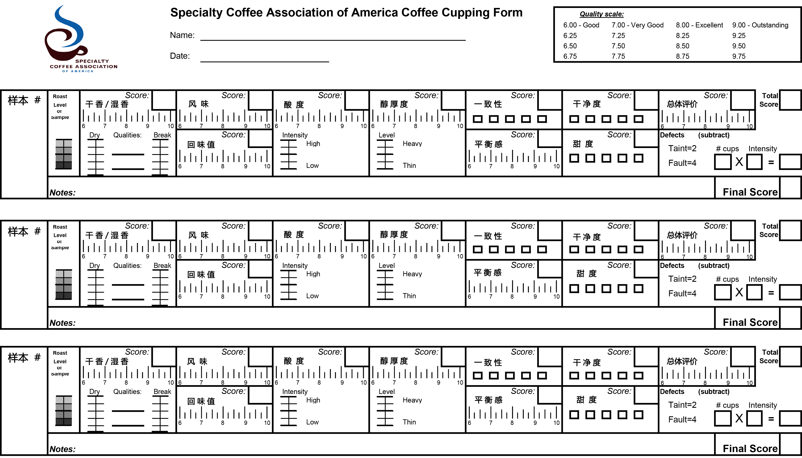

# Q Grader  ||  SCAA杯测表使用指南

参考：[《SCAA杯测表》](SCAA杯测表.pdf)

　　杯测于1890年左右由美国旧金山的席尔斯兄弟咖啡公司（Hills Brothere Coffee）为了确保每批生豆的品质，开始对进口的咖啡执行两个阶段杯测，在产地出货前先对样品生豆进行杯测，并保留样品豆，等生豆进港后再取样，进行第二次杯测验货，以确认进口生豆品质是否与先前样品一致。最初咖啡杯测是大型烘焙厂的品管程序，旨在发掘重大瑕疵，避免买到不堪用的咖啡。

　　现如今杯测已从昔日的防弊发展到今日的鉴定，享乐，调制拼配豆与比赛层面；这要归功于1982年美国咖啡精品协会的创立（SCAA），曾担任美国精品咖啡协会（SCAA）第二任理事长的泰德·林格(Tad Lingle）与1985年先后出版与修订了《咖啡杯测员手册》（The Coffee Cuppers' Handbook）以及《咖啡品鉴师风味论》（The Coffee Taster's Flavor Wheel）等书籍及图表，将香气，滋味与口感的杯测术语及流程作系统化归纳，统一标准。

　　SCAA与COE的杯测表格与准则是目前精品咖啡界最常用的两大系统，虽有少许差异但也算是大同小异的范畴。

　　今天我们主要讲解的是SCAA杯测评分表，COE杯测表不在今天讨论范围内。

　　2009年英国知名咖啡连锁企业Costa Coffee为自家意大利裔咖啡杯测师吉拉诺·培利奇亚（Gennaro Pelliccia）的舌头，向英国老牌劳伊兹保险公司（Lloyd's）投保一千万英镑，与英国女品酒师蒙特最昂贵的舌头不相上下。近年杯测师的身价有凌驾品酒师之势，杯测文化已然成型。

　　谈起杯测，一般都会认为太抽象难懂，认为自己的嗅觉与味觉不灵敏，其实只要常喝咖啡，多练习多比较，在脑海中建立完整的咖啡风味记忆库，大家都可以成为称职的杯测师。同时为几只并列的咖啡鉴别，很容易从香气，滋味与口感辨识出彼此差异，这与单独喝一杯咖啡大异其趣。

## 依照SCAA（美国精品咖啡协会）的杯测标准：

1. 杯测礼仪

   1. 礼貌对待其他杯测者，并给他们提供个人所需空间。
   2. 参与杯测期间不许使用香水，乳液，护手霜等香味大的护肤品。
   3. 杯测期间不插队，依次排队进行不催促前面杯测者。

2. 标准化烘焙

   1. 烘焙度

      根据SCAA标准，以浅烘至中烘区间，更精准的讲以艾格壮咖啡烘焙度分析仪（Agtron Coffee Roast Analyzer）的近红外线照射咖豆，艾格壮数值（Agtron Number）咖啡豆颜色数值为#58，照射咖啡粉的数值为#63，且误差在±1之内.

   2. 烘焙时间

      SCAA标准的烘焙时间在8~12分钟。如果少于8分钟，需要火力较猛，容易出现烘焙不均匀，且烘焙过快，涩口的有机酸成分不易裂解完全，出现涩感。如果多于12分钟，容易拉平咖啡的风味，且累积过多碳化粒子。

   3. 烘焙准备期

      样品豆需在杯测前24小时内完成烘焙，且置于干净无异味的密闭容器或避光包装袋内，进行至少8小时的“养豆”过程，此过程不得放入冰箱或冷藏库进行，放在干燥的阴凉处即可。

3. 标准化萃取

   1. 器具

      需要5个容量为150~180ml的厚玻璃杯或陶杯，且干净无异味、大小材质统一。杯测勺为圆形深底，容量大约8~10ml，方便吮吸，材质分为不锈钢和镀银，后者散热较快。

   2. 水质

      杯测最理想数字值的总固体溶解量（Total Dissolved Solids，简称TDS）应介于75~250ppm，即75~250mg/L。

   3. 研磨

      咖啡粉粗细度必须统一，标准为70%~75%的咖啡粉能够筛过美国20号标准筛网，即咖啡颗粒值即为0.85mm。换言之，比一般手冲时的咖啡粉要粗一些，接近于法压壶冲煮咖啡时的咖啡粉粗细。

   4. 浓度

      咖啡豆重量（g）与水量（ml）的比例为18.18。

   5. 水温

      每杯的萃取水温应为93℃。

   6. 咖啡粉在杯中浸泡3~5分钟，无需搅拌，随后破渣、闻干香、闻湿香、评鉴。

4. 标准化品鉴

   杯测环境务必保持干净无异味与安静，不擦香水不喷发胶以免人工香精干扰杯测，使用专业杯测勺利于啜吸。

   杯测勺：专用杯测匙，圆形深底，容量约为8~10毫升，方便啜吸，杯测勺有不锈钢与镀银材质，后者散热较快。

   啜吸：杯测夸张的啜吸东西，制造不小的噪音，但可提高味觉与鼻后嗅觉的测味效率，因为啜吸的同时也吸入空气使咖啡液以喷雾状入口腔，水溶性的咖啡滋味更均匀分布口腔舌头各区域，咖啡油脂粒的企划成分也更容易释放出来，从口腔后面的鼻咽部上扬近鼻腔加快品鉴速度。

- 快速读懂杯测表（共有9栏）

  1. 样品编号

  2. 烘焙程度

  3. 干香/湿香( Aroma / Fragrance )

     - 在倒入如水之前闻干咖啡粉的味道
     - 破渣时闻一闻释放出来的湿香气
     - 当咖啡浸泡一段时间之后，在闻一闻湿香气，可以在质量那一栏记录

  4. 风味/余韵 （Flavor / Aftertaste）

     - 风味(Flavor)

       　　风味体现了咖啡的主要特性，在对咖啡香气有了第一印象后，又在回甘，酸度之前进行判断。风味是透过味觉，感觉和弥漫到上颚的香气体验后的综合印象。

     - 余韵(Aftertaste)

       　　余韵是指在咖啡液吐出或咽下后怡人的风味，香气从后颚散发的风味和风味停留的时间长度。

  5. 酸度（Acidity）

     　　酸度怡人是被描述为“明快”、“活泼”，而酸度不怡人时，被描述为“酸腐”、“尖酸”，酸度有助于咖啡的活性，甜度和新鲜水果的味道；有些咖啡具有高酸度，比如肯尼亚咖啡，有些咖啡酸度相对比较低，比如苏门答腊咖啡，虽然酸度各不相同，但由于不同产地咖啡属性的不同，这两种咖啡都有可能得高分。

  6. 醇厚度(体脂感)（Body）

     　　醇厚度的质量基于咖啡液体在嘴里的触觉感觉，特别是舌头和上颚之间的感知。就质量而言，大多数醇厚度比较强的样品豆可以得到高分，因为咖啡液中存在冲煮后得到的胶质。

  7. 一致性/平衡性（Uniformity / Balance）

     - 一致性(Uniformity)

       　　一致性指同一组样品中每一杯咖啡风味的均匀度。

     - 平衡性(Balance)

       　　杯测样品的风味，回甘，酸度，醇厚度等所有不同属性在一起相互补充，相互作用就是平衡。如果样品缺少某种芳香或味道，或是一些属性太过强烈，平衡分就会降低。

  8. 干净度/甜度（Clean cup / Sweetness）

     - 干净度(Clean cup)

       　　干净度是指从开始吸入到最后回味都没有干扰性的负面印象。

     - 甜度(Sweetness)

       　　甜度是指一种愉悦丰满的味道以及任何明显的甜度，是因为存在一定碳水化合物的结果。

  9. 综合考虑和缺陷扣分得出最后总分（Overall）

     - 综合考虑

       　　综合考虑分数反应杯测者对样品主观的综合评定。

     - 缺陷

       　　瑕疵是指咖啡中明显的异味但不是压倒性的，在强度评分中扣2分；缺陷指咖啡中的异味，它可能是压倒性的，也可能引起咖啡中令人不快的味道，在强度栏中扣4分。

     - 最后得分

       　　最终得分的计算方法是先把每一项单个计分分数加起来，填在“总分”格内，然后从总分中减去缺陷分数得到最终得分，并填进最后得分方框内。

- 杯测顺序

  1. 首先应该观察样品烘焙后分的颜色，在表格内做下记录，
  2. 在样品研磨后的15分钟内，应该进行咖啡香气的评分，干香做记录；等咖啡粉浸湿后闷蒸3-5分钟，但不得超过5分钟，轻轻搅拌三次破渣让咖啡泡沫顺着勺子背慢慢滑落，这是轻嗅勺背香气，并在湿香那一栏做记录。
  3. 当样品冷却到大约70℃，浸泡8-10分钟后开始评估，吸进口中的咖啡液要尽量覆盖整个口腔尤其是舌头和上颚，因为鼻子里的蒸汽在高温中达到了最大强度，就可以对风味和回甘进行评定。
  4. 当咖啡继续冷却到70~60℃，对酸度，醇厚度以及平衡度的评分开始，平衡感是指杯测者对于风味，回甘，酸度以及醇厚度这四者相互作用的综合评分。
  5. 杯测者所偏爱的不同咖啡属性，可以在咖啡冷却过程中的不同温度（2-3次）阶段进行评价，为在杯测表16分等级中打出相应分数（0.25分为区间）。
  6. 一致性、干净度、甜度，对于这些属性，杯测者对于每杯的每个属性评价打分，其中每个属性2分（每项5个空格，每个空格2分）总高分10分。
  7. 样品杯测每款样品测5杯，如遇到瑕疵在杯测打分表记录相对应的那一杯，在一致性、干净度、甜度上相对应的扣分并写出瑕疵种类，在瑕疵（2分），缺陷（4分）记录杯数和相对应的缺点扣分。
  8. 样品温度降到21℃时，对咖啡的评价过程结束，整体分由杯测者确定，并根据所有属性结合给样品打出杯测分。
  9. 杯测评估后，所有的得分要记录在评分栏下面，最终得分要写在右下方的最后分数表格内杯测结束。

- 水平与垂直标记

  SCAA杯测表采用两种标记，如上图所示

  1. 一种是水平走向6~10分制表示质量的好坏，6分为好（Good）、7分为非常好（Very Good）、8分为优（Excellent）、9分为超优（Outstanding）。
  2. 另一种为垂直走向的5分格标记，表示特色的强弱。垂直标记仅供记录强弱，不代表质量，无关分数。垂直标记只附在“干香/湿香”、"酸度"、“醇厚度(体脂感)”三栏中，方便标示强弱度，其他评分项目无垂直标记，其他各项评分仍以水平标记为主。简单来讲，水平标记代表质量的好坏，垂直标记仅代表强度的高低。