【来源：微信公众号    浆果精品咖啡】

    咖啡烘焙师伴侣

# 前言

《咖啡烘焙师伴侣》一书出版于2014年，作者是在美国拥有两家咖啡烘焙公司的 Scott Rao，他从1994年便从事咖啡行业，目前已经写了几本关于咖啡知识的书。华夏觉得他的这本《咖啡烘焙伴侣》适合想要了解有关烘焙知识的朋友，也就是初学者，华夏也是个咖啡烘焙的初学者，所以我们就一起来读这本书吧。

他在书中提到，咖啡烘焙是一门黑暗艺术。虽然人类历史上，咖啡烘焙已经存在了几百年，但是到现在也没有一篇官方对咖啡烘焙知识理论的系统叙述。直到今天，烘焙师仍然是通过做学徒，通过拜名师来学习烘焙(机)技能。一些年轻的烘焙师也喜欢自己琢磨，不断地试错，品尝一锅又一锅的豆子，根据自己的经验而得出结论，也就是适合某种豆子的最佳烘焙曲线。Scott也是如此，在自己从业咖啡的第一个十年里，他便开始试错，并取得了一些成绩，他形容那段经历就好比在打太极，『前进一步，后退两步』。在他拥有了两家烘焙公司以后，他便开始为美国的咖啡馆做顾问，通过这个工作，Scott通晓了多种烘焙机工作原理和性能。他工作的职责还是帮助客户分析烘焙数据，从而找到适合客户自己烘焙机和咖啡豆的最佳烘焙曲线。就这么做了6年，想必他在此书中的经验总结是非常珍贵的，怪不得这么贵。所以，从几天前开始，他便是未来几天华夏的睡前读物，并把每一章节翻译出来，和大家分享。

# 第一章  为什么烘豆子？

​		咖啡豆是通过咖啡树上接的咖啡浆果成熟后把里面的种子加工而成。大多数状况下，每一枚咖啡浆果有两瓣咖啡豆，扁平的部分相对，组成椭圆形。如果把『生的』或者『绿色』的咖啡豆用热水冲煮的话，无法萃取出咖啡中美妙的风味和香气。

​		当咖啡生豆进行烘焙的时候，会产生数以万计的化学反应，（浆果旁白：作者用了Myriad一词，就是数以万计的意思，不是浆果夸张）成千上万种化合物经历了高温降解和再聚合的化学反应过程。烘焙师的希望和作用，就是通过对生豆进行烘焙，从而开发豆子中的芳香成分，而后再磨成粉与热水融合之后，将美妙的风味萃取出来。

    烘焙时产生的诸多反应中，烘焙会使豆子：
    <ul style="margin:0 0 1rem;list-style:circle;">
        <li>豆身颜色上的改变：绿色 —— 黄色 —— 棕褐色 —— 褐色 —— 黑色</li>
        <li>豆体体积增加两倍</li>
        <li>豆子密度将会减半</li>
        <li>获得，然后失去，甜度</li>
        <li>PH值将越来越显酸性</li>
        <li>开发出800种以上芳香化合物</li>
        <li>当豆子内部释放化学反应生成的气体和水蒸气时，会发生爆响</li>
    </ul>
    烘焙咖啡最主要的目的就是：
    <ol style="margin:0;">
        <li>为了优化咖啡豆中的可溶性化学物质产生的<b>香气</b>，</li>
        <li>从而在<b>萃取</b>时，来溶解咖啡中带有<b>风味</b>的可挥发性化合物和代表着香气的油脂及蛋白质。</li>
        <li>被溶解的颗粒、油脂、以及悬浮颗粒，主要是咖啡豆中分裂开来的纤维素，造就了咖啡的<b>醇厚度</b></li>
    </ol>

​		华夏仅读完第一章，就感觉作者强大的咖啡经验以及不拖沓冗长的措辞非常的精辟，每一个单词都是通过仔细斟酌以后才写出来的。既然咖啡是一个舶来品，咱们应该将其专业词汇的英文单词搞清楚，对无论是咖啡爱好者、要打比赛的人，还是考国际资格证的人，都适用。

     <b>TASTE </b>
    风味，在咖啡里主要是指通过味觉（主要是舌头）来品尝到的风味。在人类五觉中，味觉是最主观的，所以不同的人，因为不同的经验、经历、以及对不同事物的印象不同，所尝到的咖啡内容也不同。在咖啡中，是通过将咖啡烘焙以后生成带有芳香因子的可挥发性化合物萃取出来，从而体现风味的。

     <b>AROMA </b>
    干香，在咖啡里主要是通过嗅觉（鼻子）来察觉的味道。闻过生豆的朋友们都知道它除了草香别的很难闻出什么，但正是因为将其烘焙，开发出来800多种干香化合物、焦糖反应产生的香气、以及梅拉德反应产生的褐色色素那迷人的焦香等等。其实在咖啡萃取后，也会有不同的香气产生，行业内俗称为<b>FRAGRANCE</b>，也就是咖啡被萃取成溶液后的香气，经常买香水的朋友都知道，这个单词是来自法语的，主要代表液体精油或通过酒精挥发带出来的香气。在咖啡中，它是指湿香，也就是导致干香的成分与水融合以后的风味。

     <b>DENSITY</b>
    密度，这里是指豆子的密度。不同的咖啡生豆，由于不同的产地、海拔、树种、湿度、土壤、处理方法等诸多因素而不同。当生豆烘焙以后，先是在生豆中残留的水分（10%~13%）由于在高温下蒸发吸热，从而冲破细胞壁产生第一次爆响，豆子的体积会增大，密度就会减小；第二次爆响是由于化学反应中生成的二氧化碳等气体再次冲破细胞壁的响声，从而是豆子的密度更小。密度小，体积就会大。

     <b>ACIDY</b>
    酸性。这里的酸，不是我们人舌头尝出来的酸，而是PH值的酸碱性。由于烘焙程度越深，越碳化，PH值就越低。

     <b>SOLUBLE</b>
    可溶于水的。无机物是可以溶于水的，所以通过化学反应形成的可溶性化合物；有机物是不能溶于水的，比如说蛋白质和脂肪，但是蛋白质和脂肪在高温的条件下产生梅拉德反应，从而生成的褐色色素是可溶的，因为已经碳化，这也就是为什么，咖啡水溶液的颜色是褐色的，只不过因为烘焙度的不同，溶液深浅不同而已。

     <b>BODY</b>
    醇厚度。咖啡的醇厚度是通过我们人类的触觉来感知的。也就是舌头与口腔其他部分的摩擦来识别一杯咖啡的醇厚度。BODY是什么物质形成的呢？是可溶性细小颗粒（碳化了）、油脂、悬浮物质（植物纤维素）的结合使咖啡的醇厚度起到了变化。

​		目前市面上的有关咖啡在不同生产阶段的书籍非常多，无论是国外的还是国内的。华夏拜读了一些大咖的著作，各有特色，各有千秋。但由于咖啡业（这里指的是全世界范围内）发展飞速，诸多的著作理论思想淘汰率也非常的快，但是一成不变的是大家对咖啡的热爱。华夏挑选翻译的书籍仅仅是以个人角度来看比较科学全面的书籍，如果大家找到更全面的书，我们可以互相交流。

# 第二章  生豆的化学物质

> 我和店长经常会讨论一些关于我写文章的问题，从而道出咱们大多数国人不愿意学习充实自己的事实。从小到大，国内的应试教育逼着我们去学习，读死书，却从来不问为什么，从而导致我们的自学能力、独立思考能力和创新能力极差。因为国内的应试教育体制是为升学率而服务的，却忽视了培养国人的素质。很多人上学的时候，根本没有乐趣，学习唯一的目的就是考上名牌大学，步入社会找到好工作，或者赚大钱，或者图名利，到那个时候就再也不用学习了！问问在大学里所学的东西有几个能运用到工作中去的？我们学了十几年的英文，有几个可以和老外无障碍沟通的？这种体制下教育出来的人民，失去了真正的理想和抱负，而将之转移到赚大钱、当大官、买房子、开好车、穿名牌的畸形理想，三观皆毁。殊不知，真正的幸福，是拿金钱名利买不到的，金钱名利换来的只有人性的缺失、人格的衰败、人权的践踏、人心的浮躁。欲望冲昏了头脑，赚钱比学习更重要，殊不知，有这种观念的人，随着量化经济逐渐转为质化经济的今天，必将被先进思想所淘汰，被社会所淘汰，被未来所淘汰。
>
> 所以，学习的重要性是无法用金钱名利来衡量的。只有多学、多看、多走，我们才能不会肤浅的只能看到事物的表面。佛说的无常和放下我执，就是在告诉大家要透过现象看本质，只有这样，人民素质才会提高，中国未来的经济发展才会进入新阶段。
>
> 就比如说我今天阅读了《咖啡烘焙师伴侣》第三章的内容，知道了咖啡为什么会含有咖啡因？咖啡因含量与种植海拔原来也有关系！我还学到了很多对将来从事咖啡很有用的英文单词和术语；并让译者懂得了梅拉德反应的真正含义。
>
> 所以华夏写文章，只为好学的人而写，因为好学的人必定思想进步，思想进步的人才可以长久的坚持把一件事情做好，而这些人才是未来真正的精英。

​		咖啡生豆乃强硬度、绿色的种子，其成份50%是不同形态的碳水化合物，另外50%是由水、蛋白质、类脂类、酸类、以及各种生物碱基组成。咖啡烘焙师不需要知晓生豆中含有的诸多化学物质也可以烘焙出好咖啡，但是，如果知晓他们，将会有助于对咖啡豆豆性的判断能力以及大大提高烘焙技术。（此段落关键词：**Carbohydrate 碳水化合物**）

## 化学结构
​		咖啡生豆的结构是三维立体的纤维素化合物，或者说是是一个多聚醣(糖)体，其每一个质子含有大约一百万个单细胞。咖啡生豆的基质中的纤维素使数百种化学物质相互关联，通过烘焙工序，将这些化学物质转变成为油脂和可溶于水的物质，从而决定冲泡咖啡中的不同风味。咖啡生豆中的纤维素结构为其贡献了一半的重量，但是对烘焙后的咖啡风味没有起到太大的作用，但是它确实可以捕捉到影响咖啡香气的挥发性化合物，为冲煮出来的咖啡增加黏稠性，也就是增加我们人类通过触觉所感知的醇厚度。

    此段落关键词： 
	Cellulose  纤维素 
​	Polysaccharide  多醣(糖)体 
​	Soluble Material  可溶性物质 
​	Volatile Compound  可挥发化合物 
​	Viscosity  黏稠度 
​	Body  醇厚度 

## 糖
​		糖份，主要以蔗糖为主，占一颗咖啡生豆净重的6%~9%，为我们的一杯咖啡提供甜感。蔗糖在咖啡烘焙时为开发果酸做出贡献，因为在烘焙中，有一种反应叫做「焦糖反应」，就是蔗糖生成了一种物质叫做「乙酸」，也叫作「醋酸」。

​	此段落关键词： 
​	Sucrose  蔗糖 
​	Sweetness  甜感 
​	Acidity  酸感 
​	Caramelization  焦糖反应 
​	Acetic Acid  乙酸、醋酸 

## 酯类
​		酯类，主要是甘油三酯，占一颗咖啡生豆净重的16%。虽然酯类不能溶于水，但是萃取出来的咖啡溶液中却含有此物质，尤其是在出品杯测、意式浓缩、法压壶、法兰绒以及其它手冲咖啡时，酯类的含量非常高。酯类帮助萃取出来的咖啡保留香气（这里指干香和湿香）并且增加咖啡口感。咖啡生豆中酯类含量高低，直接关系到咖啡生豆质量的好坏，含量越高，生豆质量越佳。不幸的是，它在咖啡生豆中的存在也会相对地影响咖啡质量，因为会使烘焙好的咖啡豆，在储藏时，容易引起氧化和酸败。

​	此段落关键词： 
​	Lipids  酯类 
​	Triglycerides  甘油三酯 
​	Mouthfeel  口感 
​	Oxidation  氧化反应 
​	Rancidity  酸败反应 
​	Storage  存储 

## 蛋白质
​		蛋白质和游离胺基酸，占咖啡生豆净重的10%~13%。咖啡豆中的胺基酸和还原糖在烘焙过程中热解再聚合进行一系列非酶褐变反应，此种反应译者经常提到的叫法叫做梅拉德反应。梅拉德反应生成糖胺和类黑精，这两种物质使咖啡具有甘苦、呈褐色、烤肉香气、以及烘焙香气。

​	此段落关键词： 
​	Protein  蛋白质 
​	Free Amino acids  游离胺基酸 
​	Reducing Sugars  还原糖 
​	Nonenzymatic Browning Reactions  非酶褐变反应 
​	Mailard Reactions 梅拉德反应，台湾人叫做梅纳反应 
​	Glycosylamines  糖胺 
​	Melanoidins  类黑精 
​	Bittersweet  甘苦香 

## 生物碱类：咖啡因&葫芦巴碱

​		咖啡含有两大种生物碱类，那就是咖啡因&葫芦巴碱，它们各自占有一颗生豆净重的1%，是一杯咖啡中苦味的其中一个来源，它们也是轻度刺激人体的主要来源。咖啡因占咖啡苦味的10%，并起到人体刺激性作用。**咖啡树（这里之所有咖啡树种）生成咖啡因是为了抵抗虫害。一颗咖啡树的种植海拔越高，其咖啡浆果中咖啡因的含量就越低，因为海拔高，低虫害风险。**
​		葫芦巴碱或是我们所引用咖啡苦味最大的贡献者！但是他却内含许多的芳香化合物，在烘焙过程中，葫芦巴碱在高温的环境下降解成吡啶和尼古丁酸。尼古丁酸又被称为烟酸，或者**维生素B3**，200克的咖啡液里含有20~80毫升的烟酸（要看不同的烘焙度），烟酸引起反腔效应。

​	此段落关键词： 
​	Alkaloid  生物碱类 
​	Caffeine  咖啡因 
​	Trigonelline  葫芦巴碱 
​	Stimulating Property 刺激性 
​	Insect  虫害 
​	Aromatic Compound  芳香化合物 
​	Degrade  降解 
​	Pyridines  吡啶 
​	Nicotinic Acid  尼古丁酸 
​	Niacin  烟酸 
​	Vitamin B3  维生素B3 
​	Anti-Cavity Effect反腔效应 

## 水分含量

在理想状态下，处理后的咖啡生豆的水分含量应该站净重的10.5%~11.5%。如果水分含量过低，生豆成色会褪色，所冲泡出来的咖啡具有稻草和干草味。最为一个合格的烘焙师，烘焙时必须要对低水分含量的咖啡生豆的控火极为小心，因为低水分含量的豆子升温很快。如果咖啡生豆的水分含量高于12%，咖啡生豆会长毛，所冲泡出来的咖啡会有草腥味。咖啡生豆中的水分在烘焙过程中会使热传递速度减慢，所以需要加到火力使其蒸发。烘焙高水分咖啡生豆时，不仅要更多的热量，还要调整烘焙时间和火力。

	此段落关键词： 
	Fade  褪色 
    Moisture-content  水分含量 
    Hay  干草 
    Straw  稻草 
    Grassy  草腥味、青草味 
    Heat Transfer  热传递 
    Evaporate  水分蒸发 

## 有机酸

​		有机酸，主要是绿原酸(CGAs)占有生豆净重的7%~10%。绿原酸使一杯咖啡具有酸味、果酸、收敛性和苦味。罗布斯塔种咖啡豆的高绿原酸含量使其与阿拉比卡种咖啡相比更苦。绿原酸不仅对咖啡有抗氧化性，对人体也起到了抗氧化的益处。在咖啡中，也有一些其他的有机酸，如奎宁酸、柠檬酸、苹果酸、乙酸、单宁酸、甲酸。

​	此段落关键词： 
​	Organic  有机的 
​	Chlorogenic Acid  绿原酸 
​	Astringency  收敛性 
​	Antioxidant  抗氧化性的 
​	Citric  柠檬酸 
​	Quinic  奎宁 
​	Caffeic  单宁 
​	Malicious  苹果酸 
​	Acetic  乙酸 
​	Formic  甲酸 

## 气体&芳烃

挥发性芳香化合物为我们的咖啡提供香气。咖啡生豆含有200多种挥发性物质，但是它们却几乎不提供香气。对咖啡进行烘焙创造出大量的芳香化合物，目前为止，科学家已经从已烘焙的咖啡豆中提炼出了800多种挥发性芳香因子。

	此段落关键词： 
​	Gas  气体 
​	Aromatics  芳香因子 
​	Volatile  挥发性 

# 第三章  生豆处理和存储

> 当今社会，尤其是在中国，聪明人太多，但是真正成就一番事业的，没有几个是聪明人，而且可以成功的聪明人出现的几率将会越来越少。人类的基因是伟大的，经过数万年的遗传和优胜劣汰，人类的智商越来越高，所以这个社会不缺聪明人。今天一位姐姐告诉我，有一句现在很流行的话「情商可以搞定的事情智商算个P」，虽然言辞刁钻，但是不无道理。我还要搬出孔子的那句话：「何谓事业？一个人，一辈子，做一件事，把它做到极致，这就是事业。」多少人无法理解这句话？甚至认为一个人一辈子只做一件事情实属没出息、弱智、混吃等死、聪明人做不出来这么愚蠢的事情。太对了，聪明人做不出来这种事情来，因为聪明人脑筋太活，心神不定，投机倒把，见缝插针。但是耍小聪明的人害人害己，别说做事业，人都不会做，可谓大智若愚。而真正可以做成事业的是愚人，古代有愚公移山，今朝有乔布斯、马云……他们不聪明，而是智慧，懂得坚持，看准聪明人看不到的事迹，具有聪明人无法拥有的远瞻性。说白了，看看周围那些为了一件事情肝肠寸断的人，不久的将来必定成功。无论他们做什么，从事什么行业领域，都会做好。华夏妈妈从小教育就是「别和别人比，自己和自己比。」而现在社会上，大部分人都在和与自己不相干的人比，比能力，比财力，比孩子上什么学校，比房子车子，殊不知，这种虚荣智慧增长我们贪欲，儿贪欲无法使人满足，因为无法满足的贪欲是无法给人幸福感的。真正的幸福感，是珍惜眼前的一切，珍惜你所拥有的的，珍惜你爱的人和爱你的人，感恩上天对你的眷顾，并时刻思考如何为这个社会做些什么，只有这样，我们才能幸福，因为幸福来源于奉献，只有奉献才能给予我们最大的满足感。
>
> 问华夏为什么在前言里提到这些与疑问毫无相关的话题，是因为好多好多咖友们不停地在重复着问我同样一个问题：“你做咖啡赚钱吗？”我只想说，目前为止，由于咖啡市场不成熟，如果良心作精品咖啡是不赚钱的，保持生活就不错了，但是我不缺钱。听到我说的的这些，一些带有典型的文化大革命风气的人便会开始给我「戴高帽」了：“MD富二代、官二代、不赚钱就是耍流氓。。。”我不得不说，时代不同了，现代进步青年 不会再像老一辈人对金钱的渴望毫无满足了，而是追求比金钱、名利更高层次的东西，那就是自我实现，说白了就是活出自我。凭什么「天下乌鸦一般黑」？凭什么所有的人思想都是一样的？我们人类生活的大自然是参差百态的，我们人类的个性也应该如此，每个人都应该有自己的个性，拥有自己的人生路。华夏相对那些封建农耕时代的产物们说：“以后干你们的店将会越来越多！除非收起你们的有色眼镜，把父母惯出来的自私卑劣的嘴脸收回去！否则你将会被越来越多的进步高素质民众所淘汰！”
>
> 言归正传，华夏以往也曾经写过一些关于咖啡生豆处理方法以及存储的文章，也曾翻译过其他世界咖啡业内大咖有关此话题的文章。很多朋友们说和他们所得到的的资讯有出入，译者觉得这很正常，因为不同人阐述不同的观点，但是科学主题不变。在国外的一篇论文里面会有很多论点，让读者去挑自己中意的，我觉得这个是很客观的。无论做咖啡也好，还是做其他行业也好，都应该要尊重他人的意见，允许自己听到不同的呼声，只有这样，无论自身，还是他人，才可以进步。
>
> **很多人都说浆果个性很张扬，在我看来是因为国人已经习惯了「压抑自我来迎合大众」吧。如果张扬就是表达自我见解、尊重客观事实、崇尚个性自由的话，那浆果就是在张扬吧，但是不夹起尾巴做人的感觉真的很好很爽很棒！而且可以交到很多挚友，浆果愿意继续快乐幸福的张扬下去！**

咖啡生豆的处理技术及方法直接影响一杯咖啡的质量，更决定了其专有烘焙方式。咖啡生豆一旦处理完成，作为一位烘焙师必须在生豆的包装和存储条件做到很有效的控管，从而避免生豆烘焙前就开始降解。

## 下面介绍 生豆加工的主流方法：

水洗、日晒和蜜处理是现代精品咖啡的三大主流生豆处理法。

- 湿刨法/水洗法步骤：

  1. 去咖啡浆果果皮
  2. 通过发酵或机械原理除去果胶
  3. 用大量的水冲洗因发酵而变软的果胶
  4. 将连带羊皮的咖啡豆一起机械烘干（1~2天）或者日晒（3~16天）

- 干刨法/日晒法：

  此种处理方法包括两种：一种是不采摘，而是让咖啡浆果在树上被晒干再进行采摘脱壳去皮；另一种是采摘成熟的咖啡浆果，晒干后再脱壳去皮。

- 蜜处理：

  这种处理方法是指将成熟的咖啡浆果采摘以后直接去果皮，保留内部果胶进行晒干或烘干。此种处理方法与传统生豆处理方法相比，出品的咖啡更甜、更洁净。

​        水洗处理法供需卫生、咖啡口感酸度高，与其他处理方法相比可以达到质量的持久性和一致性，虽然目前市面上日晒和密处理生豆价格被炒作的不靠谱，其实水洗生豆成本要比后两者高得多的多。水洗处理出的咖啡生豆其密度(硬度)更大，对烘焙者的经验技术之要求更为苛刻。日晒法需要生豆在自然条件下数周才能变干（达到生豆的标准水份比），所产生的咖啡低酸度、高醇厚度、风味比水洗咖啡更接地气。干旱的产地通常利用这种方法处理生豆因为可以节省水源。在烘焙过程中，蜜处理法制成的咖啡生豆要比日晒或水洗豆更容易吸热烤焦，所以烘焙师在烘焙蜜处理生豆时，炉内温度要低一点，火力不能太猛。

## 咖啡生豆的仓储

最近几年，处理好的咖啡生豆都用粗麻袋（黄麻编织的）装好，并装载在货柜箱内，海运至消费国需要数月的时间。烘焙厂和进口商派人去产地进行“装载前的取样”，比如说频繁进行杯测。目的是为了避免一旦因为在运输过程中，由于咖啡豆暴露在恶劣环境条件下会变质，从而可以退回。

在过去的10年里，一些小规模的、注重精品咖啡的烘焙厂在生豆的运输和仓储方面进行了冲锋改革，很多咖啡烘焙公司，甚至是一些小型自家烘焙店，都采用与咖啡庄园主「直供」的合作方式，彼此分享杯测和生豆等级信息，此种合作方法有利于缩短运输时间、对生豆保鲜包装设计的改进、以及生豆质量关的把控。越先进的生豆包装方法成本越高，从而使精品咖啡的价格升高。

## 以下是几种常见的 **生豆包装方式 **可供选择：

<ul style="list-style:circle;margin-bottom:0;">
    <li>粗麻袋（黄麻）</li>
    
粗麻袋是最常见也是成本最低的生豆包装运输方式。黄麻是可再生资源，制成袋子成本很低，对它的使用也无需技术需求。粗麻袋无法抵御生豆受潮或者变质，而且在运输和仓储过程中容易使生豆遭受磕碰而受损。

</ul>

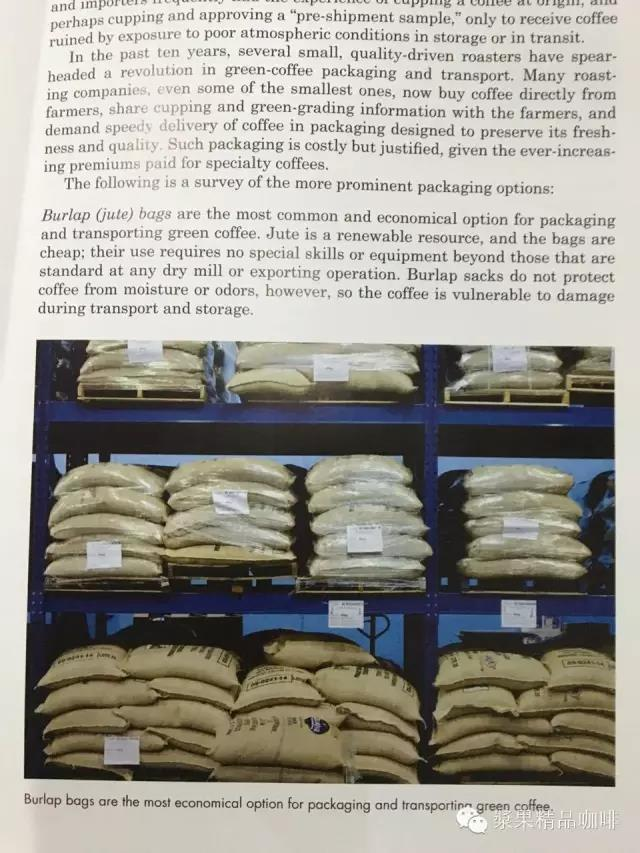

<ul style="list-style:circle;margin-bottom:0;">
    <li>真空塑料袋</li>
    
真空包装塑料袋在目前市面上来讲是最好的了，它可以防止生豆受潮、变质、氧化，它可以让生豆与空气隔绝而无法进行呼吸，也就是说可以延长生豆的寿命。在抽真空之前，必须先测量生豆含水量以及豆内水份活跃程度，以免抽真空封装后会变质长毛。真空包装成本大概每磅15~25美分（大概1块钱500克生豆），需要抽真空装置和人员技术培训。

</ul>

    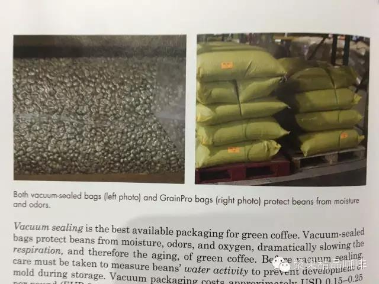
    (上图左边是真空塑料包装，右边是粮用编织袋包装，这两种包装方法有效的预防咖啡生豆受潮或变质)

<ul style="list-style:circle;">
    <li>GrainPro（粮用编织袋）</li>
    
粮用编织袋可以防止咖啡受潮和变质，而且比真空包装更好用更廉价。粮用编织袋要比粗麻袋对咖啡的存储时间更长，但是只有真空塑料包装存储保质期的一半。粮用编织袋的成本大约为每磅5~10美分（大概4毛钱500克生豆），它是精品咖啡烘焙厂的最佳选择。既然连真空包装前都要测量豆子中的水分从而避免其抽真空后长毛或者滋生其他微生物，粮用编织袋包装更加应该注意这一点。

</ul>

## 冷冻存储

​		也就是说将真空包装后的生豆放入零度以下的环境中存储，可以保质数十年。有些烘焙厂将一些独特批次的单品庄园豆如此存放个几十年，变成了「年份」咖啡豆，但是目前此种年份咖啡的需求量还不是很多。冷冻存储成本很高，说实在的，比较奢侈浪费。这种存储方法对于在潮热气候环境下是必要的，因为在极热地区存储生豆几天内就会变质。
​		无论选择何种生豆存储方法，作为一个烘焙师，最重要的就是知晓并调节好自己存储生豆处的环境全年保持恒定一致。尤其是炎热潮湿的环境，存储生豆时要离地面越远越好，可是离地面越高，温度就越高，如果生豆存储地与烘焙机过近，烘焙机散发出的热量将会使生豆品质受损。

## 水活性与水分含量

水活性是用来衡量咖啡豆中水分和其他物质之间的韧性。通过水活性可以知晓咖啡生豆中的水分蒸发和吸收的效率，也就是说，水活性可以清楚的判断出该生豆是如何与仓储地在水分方面相互互动的，并可以知道在某种环境下，咖啡豆多久后会变质。

水活性是与水分含量区分开来的，计算水活性是通过生豆中水分的重量与总重量之间的百分比。两个数值是成正比的，但是随着水分含量超过12%以后，两个数值便开始不成正比了。两种数据都会影响一杯咖啡的质量、生豆的老化率、以及在仓储中微生物的滋长风险。

笔者在生豆水活性数据方面如何影响一杯咖啡并非专业研究过，但是笔者的一位好朋友，同时也是生豆进口商和采购商对生豆水活性是这样理解的：

<ul style="margin:0;">
    <li><b>正常的生豆水活性应该保持在 0.53~0.59</b></li>
    <li><b>对于理想的生豆水分含量应该在 10%~11.5%</b></li>
    <li><b>最理想的存储环境室温应该在 20~22℃</b></li>
    <li><b>最理想存储环境的湿度应该在 45%~50%</b></li>
</ul>

以上完美数值加在一起，将对一杯咖啡的质量的持久性十分有利。对于一些冷冻存储的豆子，需要在不拆封的状况下在常温放置几天才可以进行烘焙。
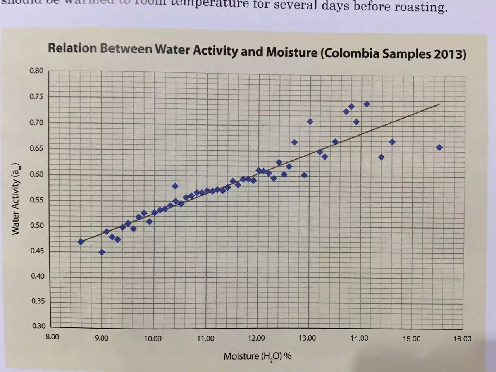
（上图是生豆的水活性和含水量之间的关系，如图可见，水份含量超过12%以后，代表水活性的蓝色点状开始扩散。说明生豆水含量过多，生豆的水活性就无法捕捉了。）

## 季节因素

近年来，很多咖啡烘焙师们只看中「当季豆」。与在咖啡领域的其他因素一样，对于咖啡生豆的季节因素迄今没有一个达到共识的概念。一些人认为「当季豆」就是最新采摘并加工的豆子；另一些人认为「当季豆」的定义是要基于采摘后某时间段的任意生豆数量来决定的。

笔者认为，我们注重季节因素原因是由于我们注重一杯咖啡的质量。一杯使你充满活力的咖啡，酸度适中，并且没有任何陈豆的痕迹（如纸味、塑料袋味、干燥、有机成分缺失等等）要比是不是当季豆重要的多得多！真的不需要把事情搞的那么复杂！

## 本章节词汇

​	Degradation  降解 
​	Mucilage  果胶 
​	Fermentation  发酵 
​	Arid  干旱，缺水 
​	Burlap Sacks  装生豆的黄麻袋，在浆果可以看到 
​	Jute黄麻 
​	Vacuum-sealed  抽真空包装 
​	GranPro  一种专利，和我们国内的编织袋很像，主要用于包装谷物和粮食 
​	Moisture  潮湿 
​	Odors  变质 发臭 
​	Oxygen  氧气 
​	Mold  长毛 
​	Microorganism  微生物 
​	Water Activity  水活性，豆子内部水分气压值 / 存储环境大气压值，理想状态下，豆子的水活性指数为0.53~0.59 
​	Humidity  湿度 
​	Seasonality  季节性 

# 第四章  生豆烘焙物理变化

烘焙使咖啡豆颜色改变、水分蒸发、体积变大、咖啡豆变脆。几乎所有咖啡业内人士都把颜色作为衡量咖啡烘焙度的标准，即使对不同烘焙度命名，但每种名称所对应的烘焙度在咖啡业内也没有达成统一的共识。

## 色变

烘焙咖啡豆的第一个阶段就是「烘干」，这几乎是所有咖啡生豆在烘焙时的必经之路。在烘焙咖啡豆的前几分钟，生豆中的叶绿素在高温下降解，颜色从绿逐渐变黄。接下来，咖啡豆慢慢的从黄色变成浅棕色，这是因为梅拉德反应引起来的。当咖啡豆接近第一次爆响，由于焦糖化反应，咖啡豆慢慢变成深棕色。如果是深度烘焙咖啡豆的话，由于碳化反应，咖啡豆将会变黑。

## 传统的烘焙度定义

浅度烘焙使咖啡拥有明亮酸度、花香、和水果风味，与深度烘焙相比，香气比较弱，醇厚度不高。深度烘焙使咖啡产生烟味、刺鼻的、甘苦和炭化风味。如果是极度深烘焙的话，咖啡味道如烧焦，而醇厚度丧失。

世界咖啡业在咖啡烘焙度上缺乏不同等级的命名，从而经常在这个问题上不仅是消费者，连咖啡烘焙师有的时候也会迷失。在这里笔者不会提供对不同烘焙度的定义，但是以下对烘焙度的命名可以根据咖啡豆的颜色，形象的描述，使大家更容易理解。

- **肉桂烘焙（Cinnamon）**

  肉桂烘焙只是因为烘焙颜色像肉桂，而不是味道像肉桂。肉桂烘焙笼统地来说，在烘焙炉里没多长时间，第一次爆响刚刚开始就下豆了。目前只有少数顾客喜欢这种青草味、花生味十足的肉桂烘焙度，不算是主流。但是，一些大型的咖啡公司将肉桂烘焙度咖啡卖给对成本非常敏感的客户，因为肉桂烘焙的咖啡豆重量流失的少。一杯肉桂烘焙度的咖啡，酸度很强，青草味、花生味十足，带有花香和青草香气，醇厚度轻盈。

- **城市烘焙（City）**

  城市烘焙是在咖啡豆一爆尾端，或者刚刚结束一爆时出炉。此种烘焙度醇厚度轻盈，酸度很高。城市烘焙现在非常流行，被誉为「第三波精品咖啡浪潮指定烘焙度」。在历史上，城市烘焙是北欧咖啡烘焙的标准。一杯城市烘焙度的咖啡酸度明显、红酒口感、果汁、如果烘焙得当会出现明显甜感，具有花香和果香，略微焦糖甜感，轻度醇厚度。如果烘焙不当，会出现青草味、柠檬味和尖酸口感。

- **饱满城市烘焙（Full City）**

  咖啡豆刚到二爆前出炉，豆子表面出油。大多数消费者钟爱此烘焙度，因为所烘出的咖啡酸度适中均衡，具有醇厚的焦糖感，中度醇厚度。一杯Full City咖啡焦糖味十足，犹如品尝熟果，醇厚度适中。

- **维也纳烘焙（Viennese）**

  维也纳烘焙度是当咖啡豆在二爆前期时出炉，也就是当油脂刚刚开始出现在豆表上。星巴克就是此种烘焙度。一杯维也纳烘焙咖啡，口感甘苦，焦糖感十足，辛辣，有时具有坚果味，醇厚度极重，犹如糖浆。

- **法式烘焙（French）**

  法式烘焙度的豆子豆表油脂很多，口感辛辣、甘苦、焦炭味十足。此种烘焙度已经无法辨别其唯一性和庄园特性。一杯法式烘焙的咖啡，口感焦苦、油烟味十足、略出现焦糖口感、醇厚度或中或重。

- **意大利烘焙（Italian）**

  大多数意大利烘焙是在中烘出炉（中烘？中烘不是城市烘焙吗？[个人觉得应该是深烘]），但是是在所有现今流行烘焙度中，颜色最深、最油、最苦、最炭化的烘焙方式了。几乎所有的意大利式烘焙时的气味都非常难闻和刺鼻，因为咖啡豆中的绿原酸和纤维素完全降解，并且迅速氧化。一杯意式咖啡焦苦味十足、烟熏味、腐臭味、炭化味，醇厚度适中。

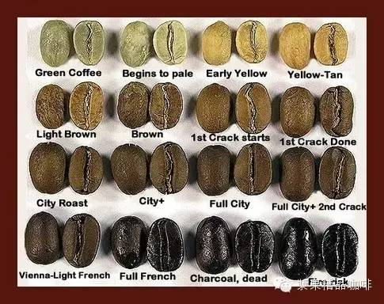

## 组织结构变化

咖啡生豆的微结构非常的排列有序和稠密，油脂包围着纤维素基。当咖啡进行烘焙时，所生成的水蒸气和二氧化碳是豆内压力增强，从而使组织结构伸展膨胀。在接近一爆的前几分钟内，咖啡豆已经膨胀的足够大从而使外部银皮开始脱落，卷在内部的银皮被困其中。当纤维素无法再伸展时，纤维开始有裂缝，其中水蒸气等气体瞬间穿破纤维组织，造成了第一次爆响。

精品咖啡烘焙师通常寻求中浅烘焙度，一般大概在一爆结束和二爆开始这个时间段出炉。一爆完成以后，豆内气体继续生成，重新在咖啡豆细胞内产生压力，与此同时，由于烘焙度的加深，咖啡豆结构边的更加脆弱，准备开始进行第二次爆响。既然一爆的主要成因是水蒸气形成压力冲破纤维，那么二爆的主要成因则是二氧化碳的剧增导致的。二爆刚刚结束时，油脂开始附在豆壁上，几乎所有的烘焙师想烘焙深烘豆的话，主要看油脂的出现。

## 咖啡豆的内部发展

烘焙过程中的一爆二爆阶段，由于豆体体积增大、水分蒸发、其他气体的生成和排除等现象，使豆子的纤维结构变得脆弱，水蒸气和二氧化碳将豆子穿刺得千疮百孔。烘焙度越深，豆子越疏松，豆子的内部环境越脆弱，豆子内部发展的完全。豆子内部发展好的咖啡，预兆了未来将会好研磨、萃取率高、和杂味少。

在烘焙过程中，豆子内部的发展相比豆外部发展而言相对滞后。一个经验十足的烘焙师应该知道如何在豆表颜色达到预期值的同时，豆内部也应该烘熟。在理想状态下的浅度烘焙，豆内和豆表应该几乎没有色差的。烘焙度越深，豆内外色差越大。本书将会有大段章节来研究这个问题。

## 豆体、密度及失重

根据咖啡豆原先的含水量、烘焙度、以及烘焙过程中豆子内部的发展，咖啡豆在烘焙前后一般来说大概失去自己原有重量的12%~24%。假设烘焙前咖啡生豆含水量为10%~12%，烘焙时间为11~12分钟，浅烘的（一爆末）失重率为11%~13%；一爆结束30秒后出炉咖啡豆的失重率为14%~16%；二爆初的失重率为17%~18%；深度出油烘焙的失重率将大于22%。目前盛行精品咖啡业的北欧浅烘的失重率约平均14%~16%。

对于浅烘来说,90%的重量流失为水分的蒸发，另外10%包括一些有机质和二氧化碳，还有一些烘干了银皮，一氧化碳、氮气、挥发性化合物和一些挥发酸。烘焙度越深，豆子中的有机含量消失的越多：中烘时有机物流失5%~8%，而深烘时有机物将流失12%。当烘焙使豆子流失重量时，豆子的体积将会是原先的150%~190%，豆子的质量和密度同时减半，体积增大。

## 本章节词汇

First Crack  一爆，豆子吸热时，水分转化为水蒸气，冲破细胞壁的声音。 
Second Crack  二爆，一爆以后，豆子再次吸热，化学反应形成二氧化碳，再次冲破细胞壁的声音。 
Carbonisation  碳化反应 
Nordic Countries  北欧国家，也就是挪威、瑞典、芬兰和丹麦四国。 
Pungent  辛辣的 
Ripe Fruit  熟果 
Nutty  坚果味 
Syrupy  糖浆一样粘稠 
Rancid  腐臭 
Carbon dioxide  二氧化碳 
Carbon Monoxide  一氧化碳 
Inner Bean  豆子内部 
Outer Bean  豆子外部 
"Spread"  咖啡英语术语，描述烘焙后，豆内外“色差”的术语/行话。 
Shrinkage  缩水，咖啡英语术语，指烘焙造成咖啡豆的重量流失比率。 
Water Voper  水蒸气 
Brittle  变脆了 
Chaff  银皮，大家知道还有一种说法是“**Silver Skin**”。两者的区别是“Silver Skin”指的是烘焙前生豆状态下的银皮；而Chaff是指烘焙之后被烘干了的银皮。 

# 第五章  烘焙化学（上）

> 今天下午接到一个电话，是一位老先生从台湾打过来了。语气很焦急的样子，说他看不到浆果的文章更新了，为什么不坚持写作？因为是店长丽亚接的电话，他告诉那位先生华夏一直坚持每天更新，可能因为某些原因看不到了。所以店长教了那位老先生如何使用大陆微信公众号，但由于通话质量不好，加上老人家不会用，于是丽亚店长便将电话转交给了我。我接过电话，对方和蔼可亲的声音非常的礼貌端庄，一听就是早年和国民党一起去台湾的人，我告诉他还有一个方法就是通过新浪微博来关注浆果精品咖啡。他仔仔细细的记下来了。然后他和我说，他一直在关注浆果的文章，概念和想法和台湾咖啡业同胞们很像，台湾的咖啡爱好者们都非常喜欢浆果，他为有浆果在大陆咖啡业里出现而感到惊讶，希望我继续写下去，坚持在大陆传播真正的咖啡文化。我听了以后，眼睛一湿。想想我这个被大陆的许多人骂的狗血喷头的公众号，竟然如此受台湾朋友们的喜爱，这么辛苦也值得了。他还说，不要改变自己的做份和观念，在大陆可能不是很被认同和接受，大陆以外的朋友们都很支持你，而且他相信不久的将来大陆人民也会意识到浆果的理念是正确的。听了这些话我心里暖暖的，自己两年来天天熬夜更新的公众号终于得到了一群人的认可，而不是只有在大陆境内寥寥无几的进步人士关注。和那位台湾先生通话后，我和丽亚激动不已，丽亚感动的眼睛里全是泪花，我们的努力没有白费，还相互调侃说我们促进两岸友好统一啦！丽亚还说如果玲玲知道了会很开心。不过说真的，每逢周末，总会来一两位台湾同胞专程来浆果喝咖啡，他们大多是来杭州旅游的、或者在大陆创业的。今天的这通电话，使我更坚定要写下去，坚持传播咖啡文化，不为别人，为的是喜爱、理解浆果的朋友们！

作为一个咖啡爱好者，烘焙工序犹如魔术，分分秒秒不能含糊：一颗坚硬无比、平淡无味的小绿豆摇身一变成为了美味的小棕豆，并释放出令人陶醉的香气。咖啡豆在烘焙时产生数不胜数的化学反应，包括了我们经常听到的梅拉德反应和焦糖化反应，这两种主要反应使咖啡豆变色，并且创造出成百上千的、原先不复存在的风味和芳香化合物。咖啡豆的烘焙使豆身变脆从而利于研磨，使咖啡豆内部可渗透性增强，通过与水的融合，更利于对咖啡豆中可溶性风味因子的萃取。

## 化学成分的变化

烘焙后的咖啡豆中，其重量的三分之一多一点是可溶于水的物质。正常的萃取方式可萃取占咖啡净重的19%~22%（或者是咖啡豆里的大约55%~60%的可溶性物质，加上很小一部分液体，以及细胞壁纤维残留物，行话称为Fines）。

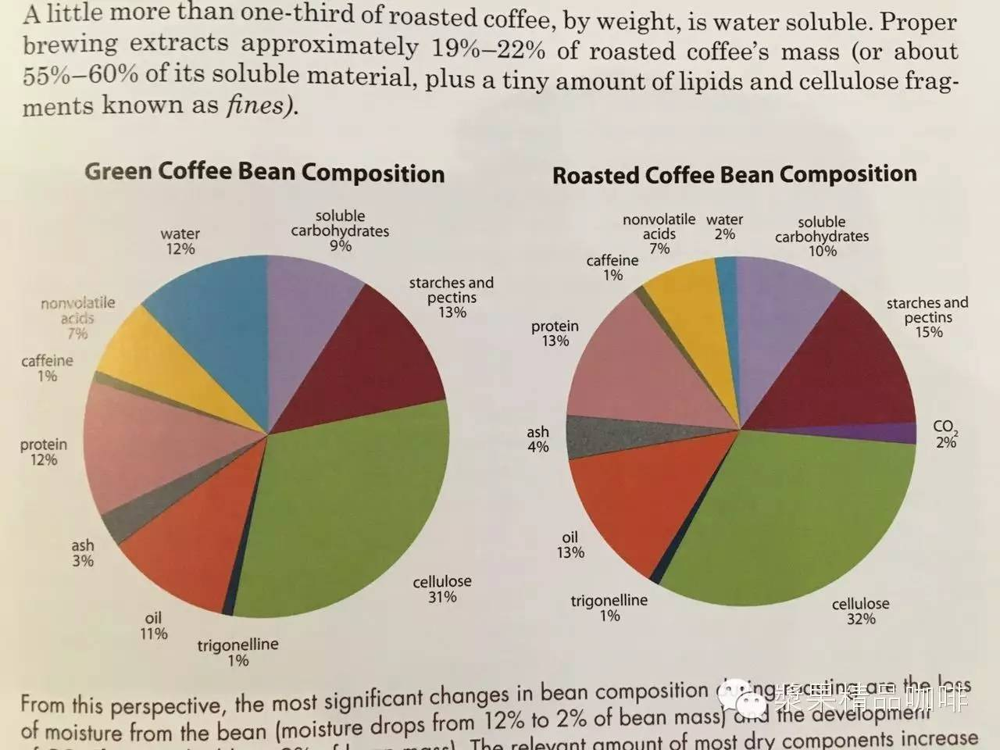
上图为咖啡豆在烘焙前后其内部化学成分的变化。我们可以看出，发生变化最大的就是含水量，由12%下降到2%。咖啡生豆在烘焙前是不含有二氧化碳的，但是在烘焙过后便产生了2%的二氧化碳。大部分的脱水成分在烘焙以后其含量都增加了1%，顾名思义是由于脱水引起的比例增加，其实这些脱水成分在烘焙前后重量几乎不变的。注：上图中各成分的百分比是笼统的，实际的比率因咖啡豆豆重的不同、烘焙度的不同、以及其他外界环境因素的不同而不同。

## 烘焙中酸类的发展

咖啡中的酸类物质赋予咖啡活力、美味、复杂和明亮。虽然很多咖啡爱好者都认为咖啡中的酸类使咖啡发苦或者不愉悦人心，但是没有这些酸类，咖啡将会变得平淡和乏味。您可以实验做一杯低酸含量的咖啡，用冷水萃取咖啡几个小时。所得到的的咖啡虽然富有巧克力香气而且口感圆润，但是因为缺乏层次感儿变得无聊单调。

绿原酸（CGA）是目前所有咖啡生豆中普遍存在的一种酸类，占咖啡净重的6%~8%。而咖啡是全世界物种中含有绿原酸最多的植物。绿原酸为咖啡酸感和苦感的重要来源，并对人带有轻微神经刺激作用。

持续烘焙可以使绿原酸降解，浅烘咖啡豆中的绿原酸只剩下50%，而深烘的大约只剩下20%。绿原酸在烘焙过程中分解成奎宁、有机酸咖啡酸、以及使咖啡产生醇厚度（BODY）的双涩酚类化合物。少许的奎宁和有机酸咖啡酸可以使咖啡味感明亮干净并带有微酸感，但是一旦量多了，咖啡的味道就变得尖酸和锁喉了。因为当萃取后咖啡溶液温度降至79℃时，绿原酸再一次开始分解。所以专业人士应该在出品时保证咖啡在79~91℃之间，从而稳定绿原酸并阻止它使咖啡变得尖酸锁喉。

    咖啡中一些少数有机酸在低浓度的状态下也可以提高咖啡的风味，一旦不衡量就会产生不讨喜的味道。这些有机酸的浓度在浅烘度时含量最高，随着烘焙度的加深则会越来越弱。烘焙咖啡也就是为了减少有机酸：
    <ul style="list-style-type:circle;margin:0;">
        <li><b>柠檬酸</b>为咖啡带来酸感。</li>
        <li>少量的<b>乙酸</b>使咖啡具有酒酵香，但是如果含量过多就会使咖啡产生醋苦味。</li>
        <li><b>苹果酸</b>是咖啡口感明亮口爽，犹如咀嚼苹果。</li>
        <li><b>磷酸</b>是在肯尼亚咖啡中发现的具有高浓度的无机酸，从而使肯尼亚咖啡具有唯一性和卓越的酸度。</li>
    </ul>
    综括的来说，咖啡的种植海拔决定了咖啡的含酸量，尤其是咖啡产区当地的<b>自然生态环境和湿度</b>决定了咖啡中酸的种类和含量。

当用酸碱度，也就是PH值来衡量咖啡的酸度时，PH值越低，咖啡的酸度越高；PH值越高，咖啡的酸度越低。烘焙咖啡豆进入一爆时酸度达到顶峰，之后便慢慢减弱。一颗生豆的PH值大概在5.8左右，在烘焙时数值开始减少，一爆时降到最低，大概只有4.8，之后其数值便开始慢慢增高。咖啡可测量酸度和酸的平衡的结合造就了我们人对咖啡中酸的感官认知。所以，咖啡消费者对咖啡中酸感直觉多少与可测量的酸度有关，但是不完全有关。

咖啡生豆中的糖份含量对其烘焙后的酸度和甜度产生很重的影响。咖啡豆中的蔗糖会产生酸是因为焦糖化反应产生乙酸。故而，咖啡农采摘咖啡浆果时只能采摘成熟的红果是非常必要的，因为红果会给未来的咖啡豆赋予更多的蔗糖。深烘焙度使咖啡中的蔗糖分解99%，浅烘焙度降解大概87%左右的蔗糖。
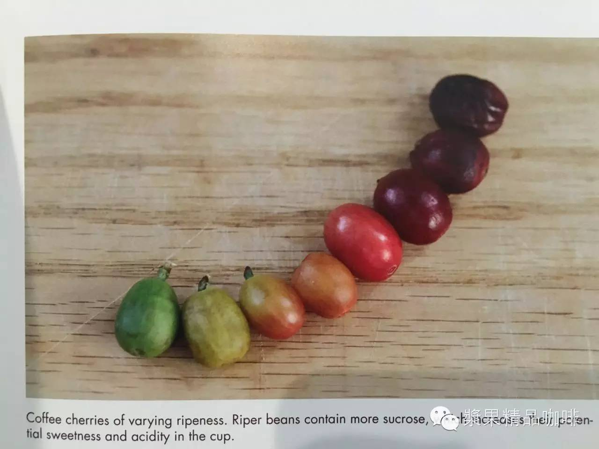
上图为咖啡浆果变红的程度不同，所含蔗糖量也不同，颜色越深，含糖量越高，意味着出品的咖啡甜度和酸感也高。

## 本章词汇

Composition  成分 
Chemical  化学的 
Fines  咖啡业内术语，也是生物化学术语，指的是那些可溶于水的，微观世界的咖啡纤维细胞壁脆片。 
Chlorogenic Acid  (CGA)绿原酸，使咖啡产生酸味和苦味。 
Quinic  奎宁 
Caffeic Acids  有机咖啡酸 
Organic Acids  有机酸 
Concentration  浓度 
Citric Acid  柠檬酸 
Malic Acid  苹果酸 
Phosphoric Acid  磷酸，只有在肯尼亚出产的咖啡中才能找到，是一种无机酸。 
Organpleptic  人体感官 
Perception  直觉 
Ripe  成熟的，变红的 

# 第五章  烘焙化学（下）

> 有些人很直白，来浆果店里就是来骂华夏的，所以在来之前都有所准备。比如说，曾经有一个人问我：“咖啡馆赚钱吗？”我说：“目前是不赚钱的。”他又问：“不赚钱为什么要开咖啡馆？”我答：“不是所有人做生意都仅仅为了赚钱。”他听到我这么一说，觉得我已经中了他的圈套，便将自己准备已久来对付我的话喷了出来：“一切不以赚钱为目的的商业行为都是耍流氓！”我说：“平白无故定义别人、给别人扣帽子的文化大革命行为才叫做耍流氓！”不是所有人做一件事情就是为了赚钱，而是为了一个理想，一个愿望，不是说不想赚钱了就不付出辛勤劳动了，而是要比别人付出的更多。而且，想赚钱，围绕着赚钱的所有功德是要通过长时间来修出来的，比如做人、行善、正道、修心、整合资源、积累经验、学习知识文化等等，只要把这些做好，功德满满，钱不用去赚，它会川流不息的「流」向你的！而当今有多少人理解这个道理？都是为了幸福而去拼搏，却不知道幸福的本质是放下欲望啊。故而，华夏慨叹：
>
> 

> 当今社会， 
> 「乐于分享」被骂「高调」； 
> 「长远投资」被骂「土豪」； 
> 「奉献精神」被骂「装逼」； 
> 「主张个性」被骂「清高」。 
> 就是「欲望」让你看不惯「人家比你好」。 
> 奉献，自己做不到的，那就抨击你！ 
> 反正网络世界里，你能把我咋地。 
> 内心强大的我全当你放屁 
> 表里如一做自己！
> 

>
> 开始翻译这本书以后，突然间冒出来好多人说已经看过此书，那为什么不写出来和大家一起分享呢？你会说：“那是因为人家不想你自不量力，脸皮那么厚！”我只想说，我不要脸，但是我有底线；我自不量力，因为不和别人比，我只和自己比。每天写文章将自己所学的和大家分享，对于我是复习，又可以和大家分享交流，利人利己，何乐而不为呢？任何东西，分享了才有价值。

## 香气的发展

在烘焙的前几分钟是发展不出迷人的香气的，直到烘焙几分钟之后才能开始发展香气。当咖啡豆的含水量降到5%的时候，可挥发性化合物开始迅速生成。焦糖化反应、梅拉德反应、以及胺基酸、酚酸、糖份、以及脂肪在高温下的降解将贡献出更多的芳香因子。焦糖化反应产生果香、焦糖香、坚果香以及其他香气；梅拉德反应生成咸味、花香、巧克力香、泥土芬芳以及其他烧烤烘焙香气。

熟豆中的可挥发性芳香化合物已溶于油脂里，并且在咖啡萃取的中、后阶段缓缓释放出来。咖啡的芳香因子含量在中浅烘焙度时达到顶峰，烘焙度越深，芳香因子被毁坏程度越甚，从而使芳香因子变成烟油而呛人。熟豆在存储时，随着内部气体的释放，芳香因子也会缓缓消散。所以，深烘豆会比浅烘豆芳香因子流失速度快，原因是由于深烘豆纤维细胞壁非常脆弱。

## 梅拉德反应和焦糖化反应

概念上讲，梅拉德反应是游离胺基酸和还原糖在高温状态下产生的非酶褐变反应，从而使咖啡颜色变深，并增加其甘苦风味和各种各样的芳香因子。梅拉德反应在我们平时烹饪食物时非常常见，尤其是在烤肉和面包的时候，散发出的迷人焦香就是梅拉德反应。

为了了解梅拉德反应赋予咖啡的风味，可以联想一下当你烤肉或者煮肉的时候风味的不同变化。烤肉时创造复杂的芳香因子，但是煮肉缺没有烤肉那么香。同样，烘焙咖啡亦是如此。

烘焙过程中，一旦豆子内部温度足够高从而将其水分蒸发，之后温度就会剧增，加速梅拉德反应。这也就是为什么芳香因子的产生是在烘焙中期开始的原因之一，当温度达到160℃以上时梅拉德反应就开始自我控制了。

与梅拉德反应不同的是，焦糖化反应是一种高温热解反应，也叫作热分解。焦糖化反应在171℃时开始进行，当烘焙高温将糖分子热解，并产生成百上千种新的化合物，包括微小的、苦的、酸的以及一些芳香分子，还有一些大的、褐色的、无味的分子。很多人都片面的将「焦糖化反应」与「焦糖」联系在一起，认为焦糖化反应会使食物变甜，犹如享用了一款甜美奶香的甜点。其实则不然，焦糖化反应，顽皮的唱起反调，降低食物中的甜感，增加苦感。对于咖啡来说，烘焙度越浅口感越甜，而深度烘焙所带来的焦苦感便是焦糖化反应所赐。

## 咖啡因含量

事实并不像我们所听到的那样，越深烘的咖啡豆其实咖啡因含量不会减少。当某种恒定烘焙温度时咖啡因保持稳定状态，烘焙对豆子里的咖啡因含量毫无影响。烘焙使豆子的质量减少，咖啡因在豆子中所占含量比重增加。也就是说，假设当我们用相同的水粉比来冲泡不同烘焙度的咖啡豆，深烘咖啡豆萃取出来的的咖啡因含量要高于浅烘，因为深烘豆的质量要比浅烘豆轻。

## 本章词汇

Lipid  油脂 
Amino Acid  胺基酸 
nutty  坚果味的 
Floral  花香 
Savory  咸味 
Earthy  泥土芬芳 
Pyrolysis  热解反应 
Molecule  分子 
Reducing sugar  还原糖 

# 第六章  烘焙中的热能传递

> 很多咖友们问我，何谓「因果」。
> 我不想像那些故弄玄虚的人，用难懂的辞藻显示自己有多厉害。
> 和翻译文章一样，我只会用大白话来叙述我的理解：
> 你想得到什么，就要先把这个给别人。
> 比如想发财，就要把钱财给别人，此乃「布施」；
> 想长寿，就要把生命给别人，此乃「放生」；
> 想开智慧，就要把智慧给别人，此乃「法施」；
>  总之，无论你对别人做了什么，最后都会回到你身上，此乃「因果」。
>
> 拿开咖啡馆来说，要想得到更多属于自己馆子个性的消费者，就要先付出，不是叫你免费给大家喝成本过稿的精品咖啡，而是要传播文化，告诉他家精品咖啡高成本的其内在价值所在。只有你让大家知道了其价值，大家才会买你的咖啡，只有你让大家知道如何去品咖啡，才会有更多的消费者对咖啡有需求。有些咖啡馆馆主，抱着「让平民都喝的起的咖啡」的侥幸心理，压低咖啡价格，而压低咖啡价格的实质就是在压低成本，低成本的咖啡不好喝，不好喝的咖啡又怎能让消费者对其有需求呢？想做一杯老少皆宜的咖啡是可以理解的，然而当今中国整体国民素质及教育无法完全达到可以对精品咖啡价值理解的等级，倘若不精选地随便传播咖啡文化的话，就算你费劲口舌，消费者也不会理解，更别提需求了。市场营销的宗旨就是「将对的商品卖给对的人」，在现阶段中国咖啡市场没有成熟的情况下，面对大众普及咖啡知识文化为时过早。因为咖啡文化在中国仍是小众，外面的数据都是骗人的，真正懂咖啡的人少之又少。即使是所谓「懂」咖啡的人，也会说出「真正的好咖啡是不苦的」的浑话。所以，很多朋友都在问我天天写文章，阅读量那么低，你怎么还那么起劲？我回答：阅读量低是正常的，阅读量高才是不正常的！精品咖啡本是小众，只要有人看，我就会写，因为看的人才是真正的中国精品咖啡文化传播者，随着时间的延续，小众将会变成大众，因为你们无时无刻不在传播真正的咖啡文化。话说回来，无常传播咖啡文化就是一种「法施」，传播咖啡文化的人正在把智慧给别人，那么，你们将得到智慧。这，就是「因果」。

一台咖啡烘焙机通过三种方式将热能传递给炉内的咖啡豆的，他们是：热对流、导热、热辐射。不同的咖啡烘焙机将不同种热传递方式混合在一起，根据他们的机理来对咖啡豆进行热传递。本章将为大家总括介绍不同设计理念产生不同热传递方式，在第七章将会详细介绍。

## 热对流、导热、热辐射

经典的滚筒式烘焙机，将热能直接传送至滚筒内部，烘焙咖啡豆的主要方式是热对流，次要方式是导热。热辐射仅仅起到点点作用，因为它是通过炉子表面热量以及豆子之间来传热，但也不能忽略不计。与笔者要好的一位工作在德国著名烘焙机品牌的负责人（应该是PROBAT）提供了该厂所制造的烘焙机热传递方式的比例：70%热对流、30%导热。

半直火滚筒式烘焙机将滚筒与火源隔离开来，从而使滚筒更好的保持受热均匀并起到恒温作用。热对流传递方式在这种半直火滚筒式烘焙机所贡献的热能比重更多一些。

流化床式烘焙机（热风式烘焙机）内部没有滚筒，它是通过高压热气流使豆子处于悬浮状态。再循环式烘焙机，比如Loring Smart Roaster（100万人民币起的，据说丁丁定了一台）将尾气再次处理，犹如涡轮增压。上述两种烘焙机的设计都是以热对流方式进行热传递为主。

烘焙一批咖啡豆的最开始阶段，虽然烘焙机已经预热至目标温度，但由于突然注入大量室温咖啡豆，使炉内环境温度剧跌。在烘焙过程的前几分钟内，对于经典滚筒式烘焙机来说，向咖啡豆传递热量的主要方式是热对流。而当炉内温度回归以后，热对流方式便开始主宰整个热传递。故而对于经典滚筒式烘焙机来说，滚筒在烘焙程序的前期是一个热能存储器。以热对流方式为主热传递方式的烘焙机在下豆前需要炉内更高的温度，目的是为了确保早期烘焙过程中热传递的准确性，所以对滚筒的质量要求很高，否则对存储热量差的滚筒来说热传递作用会大打折扣。

## 热传递与温度梯度

在烘焙过程中的前三分之一被称为吸热反应阶段，也就是说，咖啡豆在这个阶段里进行吸热，热能从豆表传导至豆内。豆子内部的温度梯度（△T）也就是豆内外温度的差值，主要是由热传递效率所决定。简单的说，温度梯度越大，豆内受热越迅速。烘焙阶段初期，温度梯度大概在50℃左右，这个数值几乎是顶点了，很有可能稍微再高一点点，然后随着时间慢慢的下降。温度梯度与烘焙时间呈反比，随着时间的延长，温度梯度渐渐变小。换句话说，烘焙初期那前几分钟过去了以后，豆子中心的温度渐渐地与豆子外部的温度相吻合，因为豆内外越来越热。总的来说，烘焙时间越快，△T峰点越高，烘焙时间越长，△T峰点越低。

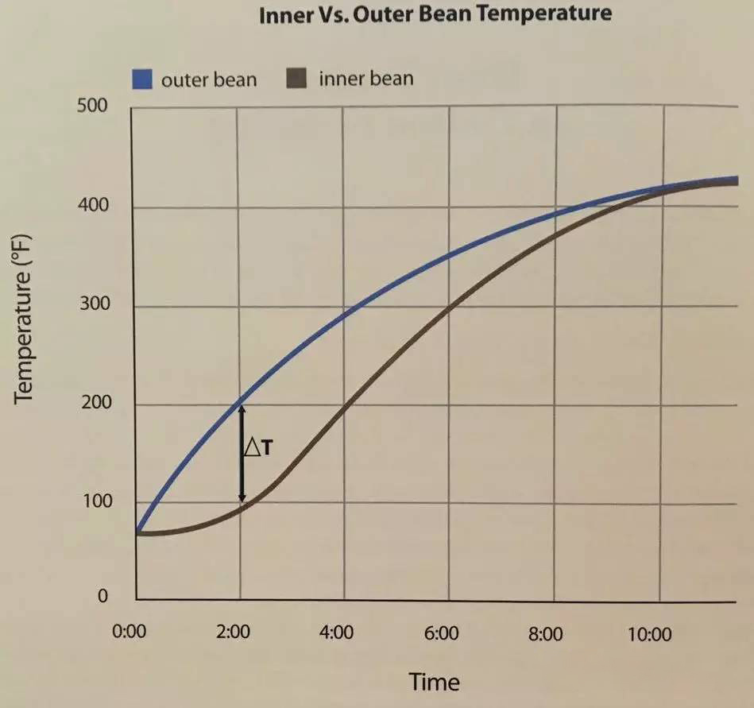

> **小窍门：**
> 烘焙初期△T增大，烘焙后期△T减小，会使豆子内部发展很好，而且会使豆子整体烘焙很均匀。

## 咖啡豆内部热能与质量的传递

在烘焙的过程中豆子表面最外层的水分首先开始蒸发，并形成“蒸发热锋”向豆子中心挺进。豆子内部的细胞纤维结构由于相对温度较低所以相对比较完整，从而将其水分困在咖啡豆中心部分。随着困在中心部分的水分受热，从而形成水蒸气，是豆内部压力增强并迫使豆子纤维结构向外伸展。研究人员将此压力的压强值估计在5.4个大气压(550kPa)~25个大气压(2533kPa)，气压在豆内逐渐加大，直到细胞壁无法承受，便冲破细胞壁排出豆体之外，也就是第一次爆响的发生（一爆）。当气压、水蒸气和二氧化碳在一爆阶段全部流失以后，豆子中心部位的温度开始骤降。

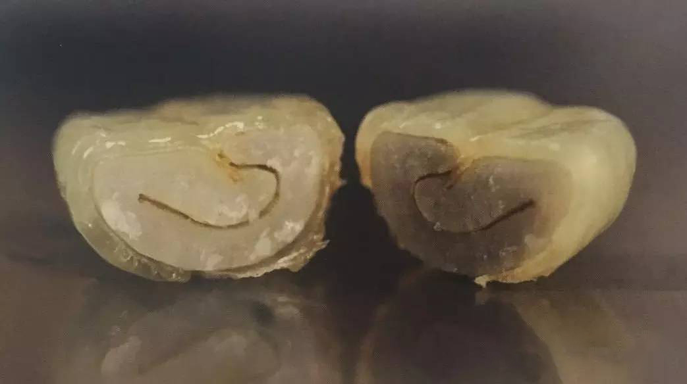

## 热传递与水分

<dl style="margin:0;padding:0;">
    <dt style="padding:0 !import;">无论是烘焙所处周遭环境的湿度，还是咖啡生豆水分含量，都会在烘焙过程中影响热传递的效果。烘焙过程中如果空气潮湿的话会增加热传递的效率，并会导致豆子的脱水速度加快。豆子的含水量对于烘焙来说影响更复杂，高含水量对烘焙过程中豆子内部热传递的影响大体上有三方面：</dt>
    <dd style="padding:0 !import;marign:0;"><ul style="list-style-type:circle;margin:0;padding:0;">
        <li>将会促进增加热传递，因为水分会增加豆子内部的导热性。</li>
    	<li>可以增加豆子的比热容，意思是说豆子要想达到某个温度的话，需要更多的能量（在豆量不变的情况下）。</li>
    	<li>会引起豆表水分蒸发加剧，却抑热能传到豆子内部。</li>
    </ul></dd>
</dl>

实际影响中，湿度越大的咖啡豆，烘焙过程中升温越慢。因此，不能片面的否定湿度大的豆子或者水分含量少的豆子，应该留意的是烘焙师在操作机器的时候，烘湿度大的豆子的时候要加大火力，而含水量少的豆子的在火力方面就要谨慎行事。

在这里，笔者用过往经验告诉大家，冬天烘豆子要比夏天烘豆子火力小一点。或者购买湿度控制器使烘焙环境的湿度恒定。

## 本章词汇

	Heat Convection  热对流 
    Conduction of Heat  导热 
    Radiation of Heat  热辐射 
    Drum  咖啡属于中特指滚筒式烘焙机 
    Surface  表面 
    Segregate  隔离 
    Recirculation Roaster  再循环式烘焙机 
    Environmental Temperature  周围环境温度 
    Plummet  骤降 
    Endothermic  吸热 
    Temperature Gradient  （△T）温度梯度，这里特指烘焙时，同一时间，豆内和豆外之间的温差。 
    Evaporation  挥发、蒸发 
    Vapor  水蒸气 
    Humidity  湿度 
    Specific heat capacity  比热容 
    Inhibit  抑制 
    Thermal conductivity 导热性 

# 第七章  烘焙机原理

> 最近好多朋友说国内刮起了「咖啡培训风」，就连星爸爸也不甘寂寞的参与其中。而且我也不明白为什么国人都喜欢跟风，而且不是甘愿寂寞暗暗淡淡地努力去做好一件自己喜爱的事。店长丽亚给我的解释是，中国人的跟风问题是因为「民风不正」引起的，太多所谓「成功」的案例都是「投机倒把」而「成功」的，误导大家成功可以走捷径、不劳而获、投机取巧。殊不知，真正的成功是需要时间的沉淀和刻苦努力的专一所换来的。社会上一些商家，抓住了浮躁社会人的贪婪无知的本性，骗取钱财。殊不知，如此卑劣行为害人害己，与自然规律相违背，到头来因果报应则是必然。通过投机倒把所得到的钱财，在未来不仅会归还，而且会损失更多；被骗者失去钱财，却无所得，心生嗔念，轻者同样招摇撞骗，重者报复社会。
>
> 换个角度来说，那些做咖啡培训的商家也是在为咖啡文化的普及做贡献，只不过亵渎了咖啡文化，因为他们将咖啡文化与钱财挂勾。你可以顺应市场供求关系而与消费者进行等价交换，但是真正的咖啡文化是无价的，是不应该涉及到钱的，因为作为一个商家，存在于市所应履行的使命就是应该「传播所售商品背后的文化」，它是使命，使命怎么在中国就以金钱来衡量了呢？
>
> 以上纯属个人意见，我没有逼大家非要认可我的想法，所以不喜欢的可以取消关注浆果公众号，认可的咱们一起努力，将这个正派的队伍不断壮大起来，感化他们。
>
> 浆果不会做培训赚钱，永远不会！对于我来说，咖啡文化应该普及，应该免费，文化不能成为商品。你想学咖啡，可以看书，可以看视频，可以来浆果和我交流，咱们一起成长，一起暗暗淡淡的把咖啡做好。咖啡，它只是一杯饮品，它很好玩，包容性很强，可以为我们的生活增添色彩，它很纯洁，好喝的咖啡千滋百味，即使苦，也苦的那么愉悦人心。

<dl style="margin:0;padding:0;">
    <dt style="padding:0 !import;">咖啡烘焙机是一种通过对咖啡豆进行混合搅拌确保受热均匀并通过热能传递来烘焙咖啡豆的专业锅炉。当今市面上的精品咖啡烘焙机有以下几种：</dt>
    <dd style="padding:0 !import;marign:0;"><ul style="list-style-type:circle;margin:0;padding:0;">
        <li>传统式滚筒烘焙机</li>
    	<li>间接加热式滚筒烘焙机</li>
    	<li>流化床式烘焙机</li>
        <li>再循环式烘焙机</li>
        <li>其他</li>
    </ul></dd>
</dl>

再循环式烘焙机将燃烧后的尾气的一部分再次推送到燃烧室进行再次燃烧，从而在烘焙过程中起到助燃作用。没有尾气再次燃烧功能的烘焙机我们称它为“单次燃烧”。不同种类的咖啡烘焙机都存在优缺点，目前还没有任何一款新发明的咖啡烘焙机可以取替传统滚筒式咖啡机的地位，在过去的一个世纪，烘焙机技术实属换汤不换药。

## 传统式滚筒烘焙机（又称经典鼓式烘焙机）

传统式滚筒烘焙机的主要部件就是圆柱形的、可旋转的铁桶/钢桶，以中心轴为支点，与地面平行并横卧在机器里，加热火苗在滚筒的底部。火力直接与桶壁接触，其热风传到桶内。风扇将热气从烧室吹送到铁桶内正在烘炒的豆子，并将桶内的烟、蒸汽、以及在烘焙过程中生成的其他残留物和焚化物通过垂直的烟囱排出，或者落在银皮回收塔里。铁桶滚动将咖啡豆混合，从而使咖啡豆与桶壁之间进行热传导吸热（Conduction）、咖啡豆与桶内热风进行热对流吸热（Convection）。

烘焙完成，烘焙师将滚筒闸门拉开，咖啡豆缓缓落到冷却盘里，并开始进行搅拌，冷却盘上面是蜂窝状的，里面是一台大马力风扇将室温空气吸入冷却盘里，从而达到在短时间内冷却咖啡豆的作用。

目前最好的滚筒烘焙机具有双滚筒，一大一小同心圆，桶与桶之间的距离在几毫米宽。在双滚筒烘焙机加热时，外面的桶与火苗直接接触，与此同时内桶稍微凉一些。双滚筒式烘焙机减少桶壁与豆子之间的热传导，从而限制烘焙时引起咖啡豆的两端出现焦点（Tipping）、在烘焙初期灼伤豆子表面（Scorching）、和在烘焙后期灼伤豆子表面（Facing）的风险。如果您选择传统式烘焙机的话，强烈建议购买双桶机。

- **传统滚筒机的好处**：无尾气再次燃烧功能的桶内环境相对比较干净，滚筒存热能效果好，为豆子提供热传导吸热功能，尤其是在烘焙初期前几分钟表现极佳。
- **传统滚筒机的弊端**：若滚筒过度加热，容易造成豆体表面灼伤。

    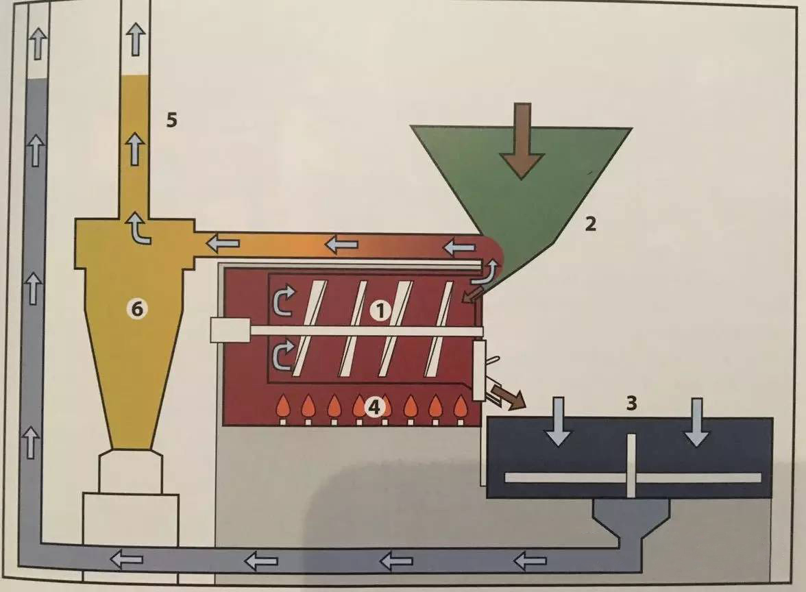
    上图为传统式滚筒烘焙机示意图。褐色箭头代表咖啡豆，从入豆仓（2）进入烘焙滚筒（1），烘焙完成后，将咖啡豆导入冷却盘（3）。热风从燃烧室（4）进入滚筒内，尾气被吹至烟囱（5）银皮收集器（6）收集飘下来的银皮。

    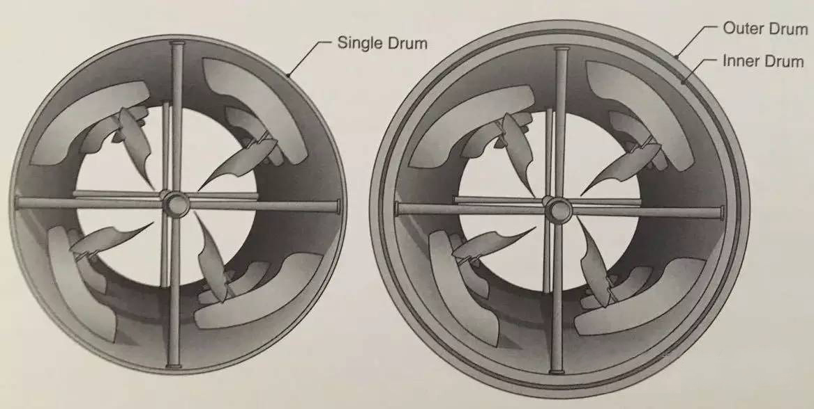
    上图左为单滚筒，上图右为双滚筒。

    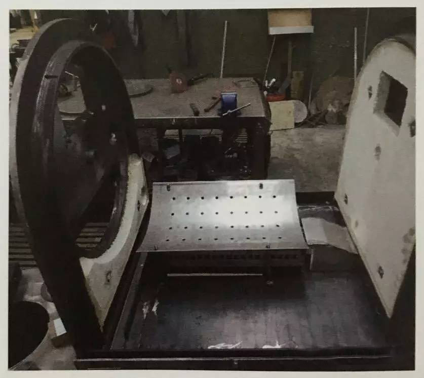

一些烘焙机制造商为了节省成本，放弃双滚筒技术，改为在燃烧室上方滚筒下方放置一张带孔钢板，又称“隔热盾牌”。此商家声称其效果与双滚筒技术相比没差，但是问题来了，由于那块隔热板一直固定在火的上方不停的与火苗接触。（在这里特意讲一下，双滚筒的目的就是为了内外滚筒受热均匀，而不是部分过热导致热传导吸热不均匀。）笔者通过红外线温度测试仪对那块进行测温，温度为950℉（510℃），即使是关火以后，铁板的余温仍然通过大量热辐射继续对上翻的滚筒进行加温度，所以不科学也不可取。

## 间接加热式滚筒烘焙机（又称热风机）

是指燃烧室产生的热风直接送到烘焙滚筒中进行烘焙。此种设计防止因火焰直接接触烘焙滚筒外壁而导致桶内豆子表面灼伤，烘焙师可以利用此技术大火力烘豆从而增加风味和香气。与传统滚筒烘焙机一样，豆子在滚筒内混合搅拌均匀受热，烘焙好了以后倒入冷却盘中迅速冷却。

- **好处**：此种技术使烘焙内外环境整洁干净，烘焙效率高因为升温快，不容易将豆表灼伤。
- **弊端**：间接加热要比传统式烘焙机稍费煤气。

    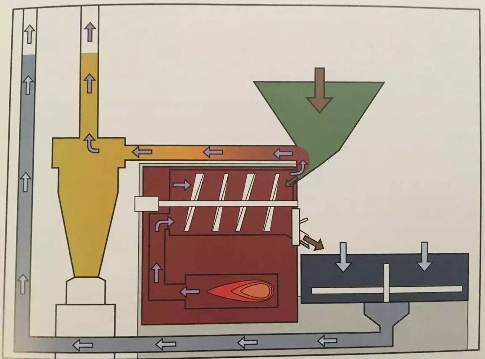
    上图为间接加热式滚筒机（其实就是热风机啦）

## 流化床式烘焙机

是指依靠大气流将豆子在烘焙仓中保持悬浮状态并不断旋转。因为在烘焙过程中，豆子的密度越来越小，此种烘焙机需要在烘焙前期风力加大从而使之悬浮并旋转，而在烘焙后期将风力逐渐减小。

几乎所有的流化床式烘焙机都不配备冷却盘；取而代之的是当烘焙完成以后，烘焙机将室温风流灌入烘焙仓来进行冷却，也就是烘焙仓和冷却仓为同一个地点。这种技术非常不理想，因为烘焙仓内壁表面温度在完成烘焙时非常高，会影响冷却速度。大部分的流化床式烘焙机的使用者为了解决这个问题，只能再单独买一台冷却盘了。（脱裤子放屁）

- **优点**：流化床式烘焙机廉价，性能可靠，机体小，灼伤豆表几率极小。
- **缺点**：过分大的风俗毁坏咖啡风味，费煤气，操作起来非常繁琐，因为烘焙师要边控制煤气边调节风流速从而使风未达到最佳状态，而且还要知晓咖啡豆在悬浮旋转过程中的转速，非常复杂。

    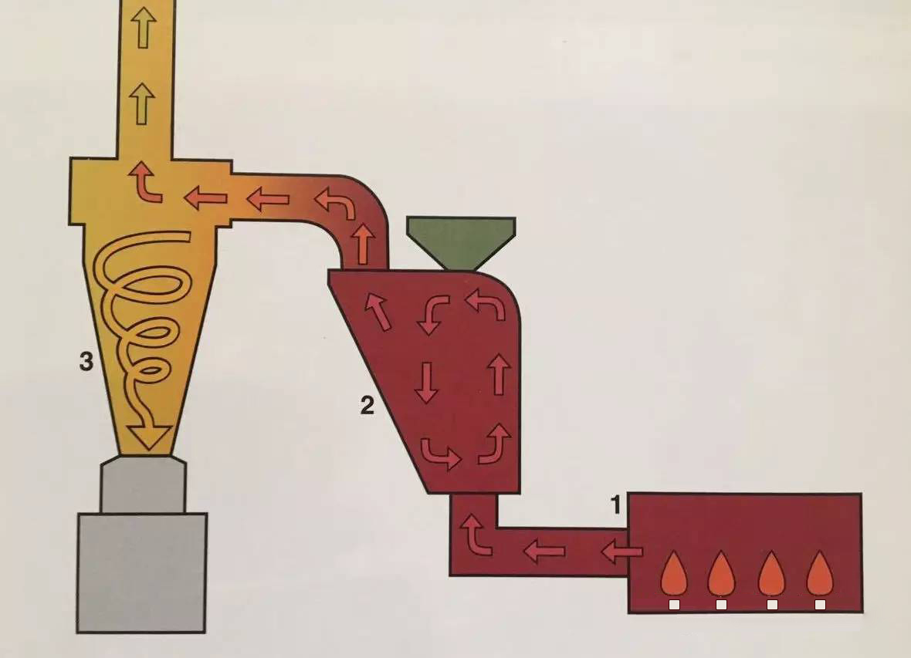
    流化床式烘焙机烘焙咖啡豆时基本完全是对流吸热（Convection）。气流在燃烧室内加热（1）并传送至烘焙室（2）然后从烟囱飘走，银皮落在银皮收集器中（3）。咖啡生豆从绿色的斗处进入烘焙室，在烘焙室里漂浮、旋转，此图未显示下豆处。

## 再循环式烘焙机

与单循环烘焙机不同，再循环式烘焙机将已经燃烧过一次的尾气再次送入燃烧室进行再次加热，从而在烘焙过程中节省燃料（煤气）。此烘焙机技术目前非常流行，因为它具有节能减排的美德，限制豆表灼伤，并为咖啡豆提供稳定、细腻、一致的烘焙环境。（听说丁丁预定了一台100W的Loring哦，羡慕嫉妒恨啊）。其稳定的烘焙环境归功于机器内设有自动跟踪获取内部烘焙分析曲线。美中不足的是，由于尾气再次燃烧也就意味着尾气再次通过烘焙仓而使咖啡产生烟火味。

- 优点：省煤气、烘焙效率高、豆表灼伤几率很低。内置全自动跟踪获取烘焙曲线分级数据软件。
- 缺点：会产生烟火味，（丁丁说：爱你不上火！）贵，（没事，丁丁买得起）

    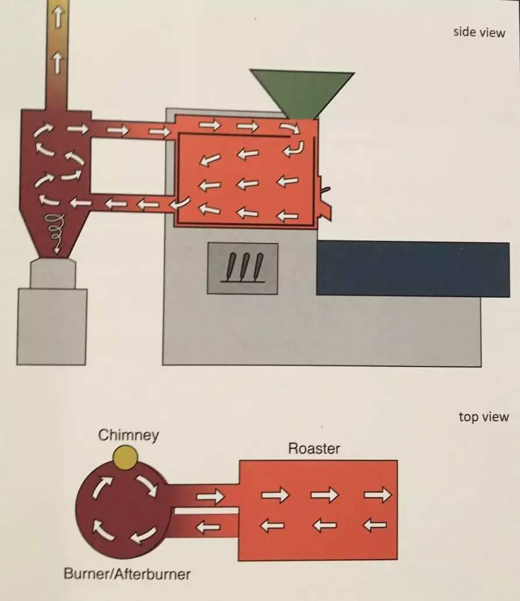
    上图为再循环式烘焙机原理，烘焙机将尾气再次循环利用，尾气再次通过烘焙仓进入燃烧室。此种技术吸热原理完全是热对流。燃烧室也是再次燃烧室，白箭头代表热风流向，与传统滚筒机一样，绿仓入豆，蓝色的冷却盘出豆冷却。

# 第八章  烘焙进度

> 昨天，一位客人在店里吐槽商业咖啡不好，没有精品咖啡好。我非常不同意的说：“商业和精品没有可比性，没有商业咖啡哪里来的精品咖啡？因为精品咖啡也属于商业咖啡，它只是商业咖啡下面的一个分支，当今中国社会，把精品咖啡搞玄乎了，弄的格格不入高大上，与消费者相隔甚远，无论是商业咖啡还是精品咖啡，都在为祖国的咖啡文化传播做贡献，作为世界第二大贸易商品，咖啡的盛行将会对中国未来经济发展有利！”
>
> 他接着又问：「对中国咖啡市场怎么看？」当时我突然想起了浆果的挚友、一位明明可以靠颜值、非要当钢琴老师的苦逼女神Eleven曾对我说过的话：“女人的穿戴要符合自己年龄和身份，假如我披金戴银、香车名牌的，别人看了会怎么想？不是买得起买不起，也不是为不为别人活，而是对这个社会负不负责！”想到这里，我便拿它做了个比喻：“中国咖啡市场好比妙龄少女，浑身穿着高档名牌，自以为高人一等，却毫无成就和内涵，其家长就是个三观扭曲的拜金主义者，孩子又能好到哪里去。父(gan)母(die)的钱早晚要花光，到一无所有时，她才懂得：做人，要务实。”
>
> 目前咖啡人口在中国虽然比重不大，但是咖啡消费增长率一直保持平稳上升状态，没有下降过。仍然希望咖啡行业内的朋友不忘我们中国茶文化的前车之鉴，不能像茶一样，把咖啡搞的那么邪乎。而是应该团结起来，各抒己见，求同存异，寻找一个属于我们中国人的咖啡体系，行业内的人一起去遵守，行业外的人拿它对咖啡业进行监督，只有这样中国的咖啡业才能发展。

每次烘焙过程中，大多数烘焙者倾向于关注前段和后段，也就是“脱水阶段”和“发展时段”。这种方法很有局限性， 会因过于简单而引起误解整个烘焙工序。我们将看到，整条烘焙曲线在烘焙过程中是对脱水阶段和发展阶段产生影响的。

## 烘焙曲线的假象

    咖啡烘焙曲线一般是“S”型，像一个大对号。当锅炉内部温度达到指定温度后下豆入锅，咖啡豆温度骤降，70~90秒以后回升，然后迅速增温。事实上，豆子的温度是不会下降的：当豆子被导入烘焙炉中时的温度与室温相同的，并且立刻变热。炉内温度的骤减是由于入豆时所进入到炉内的室温空气、以及炉内测豆温的探针造成的温度传感器滞后造成的假象。笔者建议不要在烘焙前段这2~3分钟花心思纠结当时温度的度数。几乎所有的烘焙机，豆温探针的读数只有在烘焙开始后第三分钟左右才有价值。
    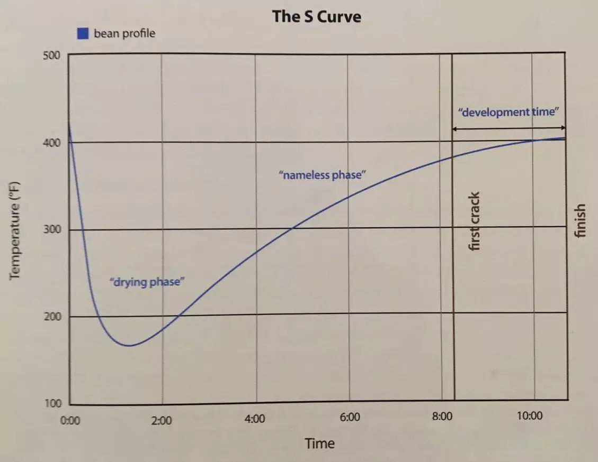
    （上图解释：“S”曲线是在咖啡烘焙过程中豆温探针所测温度读数的典型代表。在曲线的最底端，探针读数开始骤增，之后便缓缓增加。）

    豆子的探针所测的温度读数仅仅是一堆豆子豆表温度的估值，它却不能精确的呈现豆表的真实温度。探豆针温度读数精确与否其实并不重要，它仅仅在尽职于诠释豆子与其所沉浸在的温度环境之间的介质。对于烘咖啡来说，这个介质则是豆子和热气的结合体。
    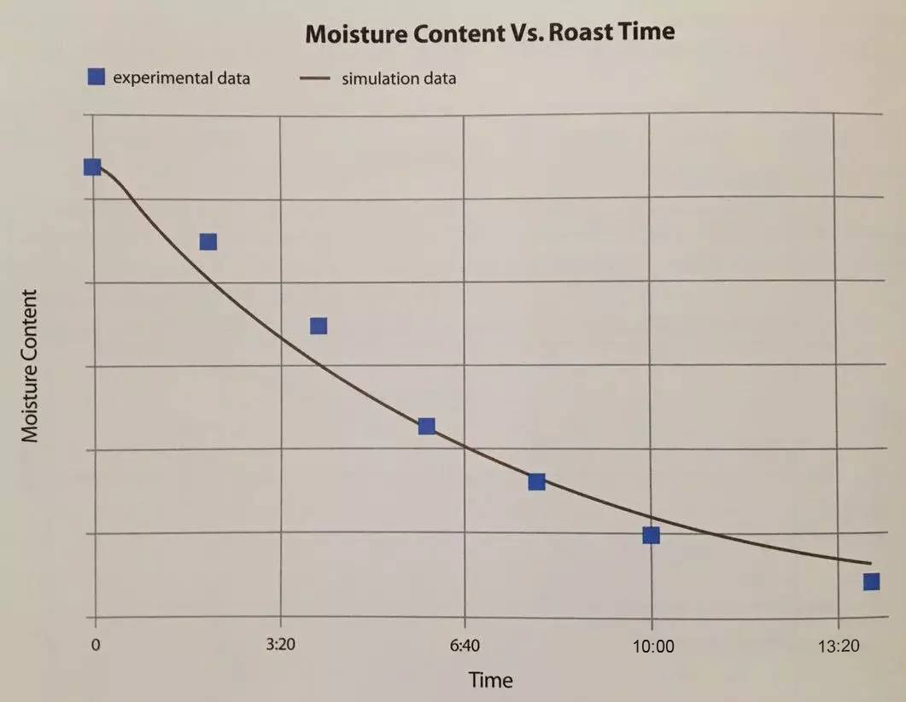
    （上图诠释了，在一爆以前，豆子的失水率保持平稳）

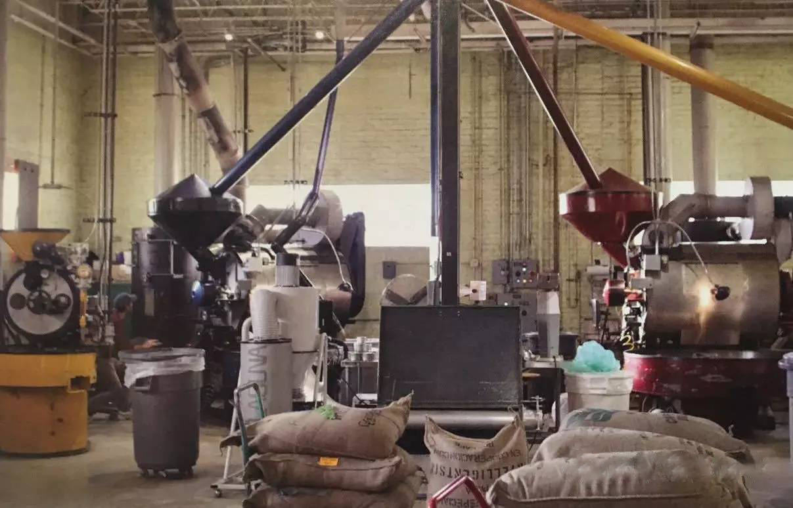

## 脱水阶段之谜

笔者一直因为每次和别人讨论烘焙时，很多人都会混淆“脱水阶段”和“发展时段”的概念而感到困惑甚至恼怒。烘焙咖啡是一个非常复杂的工序，因此豆子的发展、不断的脱水、以及其他的变化都是一直进行着的，没有先后可言。也就是说，关于烘焙过程中的，把脱水阶段说成是烘焙前期，把发展阶段说成是烘焙后期完全不科学，更是一个巨大的误解。

## 烘焙中段（无名阶段）

烘焙几分钟后，咖啡豆开始上色或者呈浅棕色，也就到了经常被疏忽的烘焙中段（无名阶段）。在这个阶段中，糖**分解**并形成不同的酸，与此同时咖啡豆释放蒸汽，个头开始变大，并发出令人愉悦的面包香气。颜色和香气的生成主要是因为**梅拉德反应**引起的，梅拉德反应是在豆温达到121℃~149℃开始反应的。

大约在豆温171℃时，焦糖化反应开始了，此时糖份开始讲解，因为**焦糖化反应偷走了梅拉德反应的燃料（糖），于是梅拉德反应开始放缓下来**。焦糖化反应越深，豆子颜色越深，并产生果香、焦糖香、以及坚果香气。梅拉德反应和焦糖化反应只能使咖啡豆由甜变得越来越苦。

在这个所谓无名阶段，由于豆子的伸展变大，银皮脱落下来。与此同时，烟味也开始发展起来，也就是说，烘焙师此时应该加大风速，将脱落的银皮和烟在他们刚刚形成时便把它们吹走。在此阶段如果封门使用不当便会使咖啡具有不愉悦的烟火味，更可怕的是，如果脱落的银皮在烘焙机内部堆积容易造成火灾。

## 第一次爆响（一爆）

咖啡烘焙过程有时会很无聊，但一爆永远是那么令人兴奋。犹如美丽的乐章，豆子发出一系列爆裂的声响，开始的时候恬静，之后音量加大，越来越强，最后慢慢变弱。而豆子则开始自然的变大，银皮开始脱落，烟越来越多。早先提到了，一爆是由于豆子内核生成二氧化碳增压、水分蒸发破豆释放引起的爆响。

一爆的时候，豆表温度在一定时间内降低（可能只有几秒钟，大多烘焙机的温度探测仪几乎无法显示其温度变化）的现象称为「吸热闪降」，此种现象是由于大量的水蒸气被释放，将豆表温度「吹」低了。

    一爆的前一刻，豆子的温度上升率（TROR）变得平缓。也就是说，当火力不变，如果你发现每分钟温度差值越来越小，或者升温越来越慢，那么，一爆就要来啦！在「吸热闪降」的时候豆子的温度降低，之后迅速升高，变化只有短短几秒钟。
    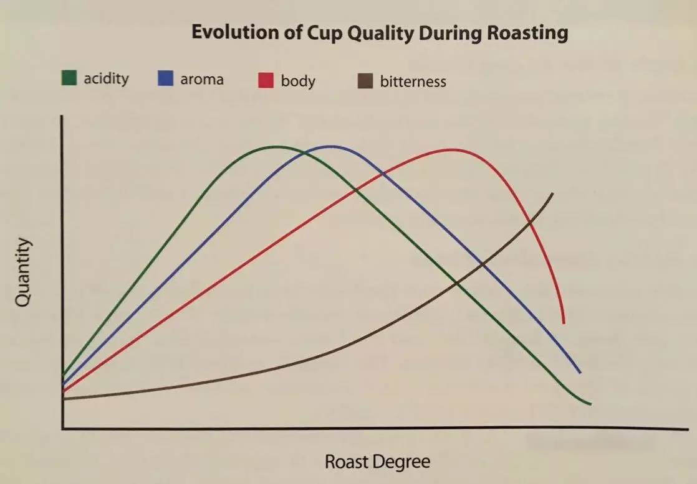
    上图诠释：在咖啡豆接近都市烘焙（中烘）之前，豆子的酸度（Acidity）呈上升趋势，之后便开始减少酸度。紧随其后的是，香气（Aroma）达到最高点，也就是大概在全都市烘焙的时候（中深）。法式烘焙（深烘）时，咖啡的醇厚度（body）最高，之后便慢慢的开始下降。法式烘焙的时候是最有萃取潜力的，但是之后便开始衰退，原因是由于热解反应将所有的可溶性物质都碳化了。

## 第二次爆响（二爆）

一爆完成以后，便会出现一段平静期，在这期间，通过化学反应所生成的二氧化碳在豆心重新建立起豆内压力。这次的压力将豆内部的油脂逼到豆子表面上来，原因是由于热解反应和一爆造成的豆表重创已经使咖啡豆的纤维细胞组织结构变得非常脆弱。大约在你发现豆子表面的第一滴油脂的时候，第二次爆响突入袭来，二氧化碳以及豆心的油脂通过压力释放出来。

当咖啡豆烘焙到二爆阶段就已经毁掉了绝大多数咖啡豆独一无二的的庄园特性了，其原因是由于焦糖化反应和热解反应产生厚重的、刺鼻的、烤焦风味，这种油烟味，即使是还有残留的风味也被它压下去了。一杯深烘咖啡带有甘苦和烟熏风味，其醇厚度如糖浆，酸度极少。如果进入二爆阶段以后继续烘焙的话，烧焦味、炭火味便开始出现，而醇厚度开始衰退。目前，连锁性商业咖啡进入二爆，精品咖啡店很少为之。

## 发展时段

很多烘焙师将从「一爆」到「出炉」的这段时间称为“发展时段”。这种错误的理解由于将烘焙过程形容的过于简化，而误导了很多人。其实，在将生豆放入炉内的几秒钟之后，豆内部便开始发展直到烘焙结束。烘焙师们一直致力于改进发展时段，尤其是烘焙Espresso（意式浓缩）的时候，一爆过后，将烘焙时间拉长。延长一爆过后的烘焙时间将会增加豆心的发展，但其实提高豆心发展最有效的办法是在烘焙前期将温度梯度拉高。刻意的在烘焙过程后段延长几分钟通常会出现灼热的（Baked）风味，这是可以避免的。

理解整个烘焙曲线的趋势会影响豆子的发展和失水非常重要。在第十章《烘焙三戒》中，我们会重点研究为了提高豆子的发展和甜感，如何创造烘焙曲线，以确保产生灼热风味（Baked）的风险。

## 本章节词汇

	Dry Phase  脱水阶段 
    Progression  进度 
    Development time  发展时段 
    Bean Probe  这里指的是炉内温度测量探针 
    Thermometric Lag  热传感滞后 
    Rate of Rise  升温率 
    Endothermic Flash  吸热闪降 
    Pyrolysis  热解反应 
    Soluble mass  可溶解物质

# 第九章  烘焙计划（上）

> 先扯扯有的没的，今天店里来了两个踢馆的，点杯卡布，喝了以后说去了那么多家咖啡馆，数你家的最难喝。我说，人的味觉是非常主观的，好喝难喝其实也很主观。既然您觉得难喝，那就请以后不要再来，因为对于你，浆果的咖啡永远是难喝的。他无话可说，又看了看电视里的我在《食话》里演讲，然后很不屑的告诉我，所谓「咖啡是世界贸易额排名第二」是错的！我问为什么，他说不知道曾经哪里看到的一篇文章说这种说法是错的。我说，首先，这种说法不是空穴来风，是联合国下属机构ICO（国际咖啡组织）和WCR（世界咖啡研究学会）通过与美国纽约阿拉比卡期货市场和伦敦罗布斯塔期货市场合作共同得出的结论，而且每年都有上涨的趋势，请问你的那篇文章权威吗？他无言以对。这就是中国的教育体制所导致，咖啡文化本身是一种灵活多变的文化，囊括了许多国家的风度民情，她的包容性超出世人想象，突出思想自由、人文自由、民主互相尊重的原则，主要表现在推崇参差百态乃万生本源的理念。咖啡馆本应该是参差百态的，人也应该有不同的个性的，凭什么全国14亿人口想法都非要一摸一样呢？而现在很多咖啡从业者，真可谓才疏学浅，井底之蛙，不知天高地厚，以为自己拥有几张证书和三脚猫的功夫就可以出去踢馆了。咖啡毕竟是舶来品，寻根溯源才能对齐有深刻的理解，才能将其变成自己的东西，从而发扬光大。而不是通过几天的皮毛培训，就敢出来踢馆啦？更何况，咖啡本来就是一杯普普通通的饮品，为何要把它搞成如此玄乎？人云亦云的想法对咖啡文化在中国的未来发展时没有好处的，因为咖啡本身就象征着民主和自由，不能真正理解什么是民主和自由的人，更加无法理解咖啡，那就拿杭州佛学院冯教授的一句话来概括这种人一生的宿命吧：“读死书、死读书、读书死！”
>
> 今天，突然间想起了不知何时听过的一则小寓言：
> 

>  
有只小老鼠，觉得自己好渺小啊！特别希求最伟大的东西。一天，他抬头一看，天空广阔无垠，就觉得天是最伟大的。于是对天说：“你是不是什么都不怕？我好渺小，请赐我勇气吧！”天告诉他：“我也有怕的，我最害怕乌云，因为乌云能遮天蔽日，他遮住我的眼睛时，我什么也看不见了。”

>  
小老鼠觉得乌云更了不起，就去找乌云：“你能遮天蔽日，应该是最伟大的。” 乌云说：“我也有怕的。我最怕风，风一吹就把我给吹散了。”

>  
小老鼠又跑去找风，风说：“我也有怕的，我最怕墙！地上有墙的话，我根本绕不过去，所以墙比我厉害！”

>  
小老鼠就跑去找墙：“你连风都挡得了，你是不是最伟大的？”墙说了一句令他非常惊诧地话：“我最怕的就是老鼠，因为老鼠会在我的身上钻洞。总有一天，我会因为若干鼠洞而忽然倒塌！”

>  
这时候，小老鼠恍然大悟，找来找去，原来最伟大的就是自己。

> 

>
>
> 人都是独立的个体，都应该有自己的特色，更应该有自己的长处。不能因为看到别人在某一方面比自己好，就把自己贬的一无是处。「尺有所短，寸有所长」，再伟大的人，也有自己的短处。再渺小的人，也有自己的优点。不必拿别人的优势来和自己的短处比。你的长处或许是他人永远也无法比拟的。
>
> 当今社会，很多人都喜欢贪执自己的目标。达不到的时候，就羡慕别人。觉得别人比自己完美，总想成为别人。很多客人来店里，经常会告诉我：“某某家的咖啡馆也有知识分子的豆子；某某家也买Probat烘焙机了；现在咖啡馆越来越多了，而且设备超土豪，华夏你难道没有压力吗？”我笑了笑说：“俺妈教我，不和别人比，和自己比。”很多人开咖啡馆要么一时兴起，要么是急功近利，要么是跟风。而我，要做咖啡做到死！

在烘焙一锅豆子之前，佚名烘焙师必须要做出很多决定。她/他必须要考虑本次烘焙的入豆量，还要考虑烘焙机的性能以及所烘豆子的特征，从而选择烘焙时的火力和温度、最初天然气设定以及风门大小。

