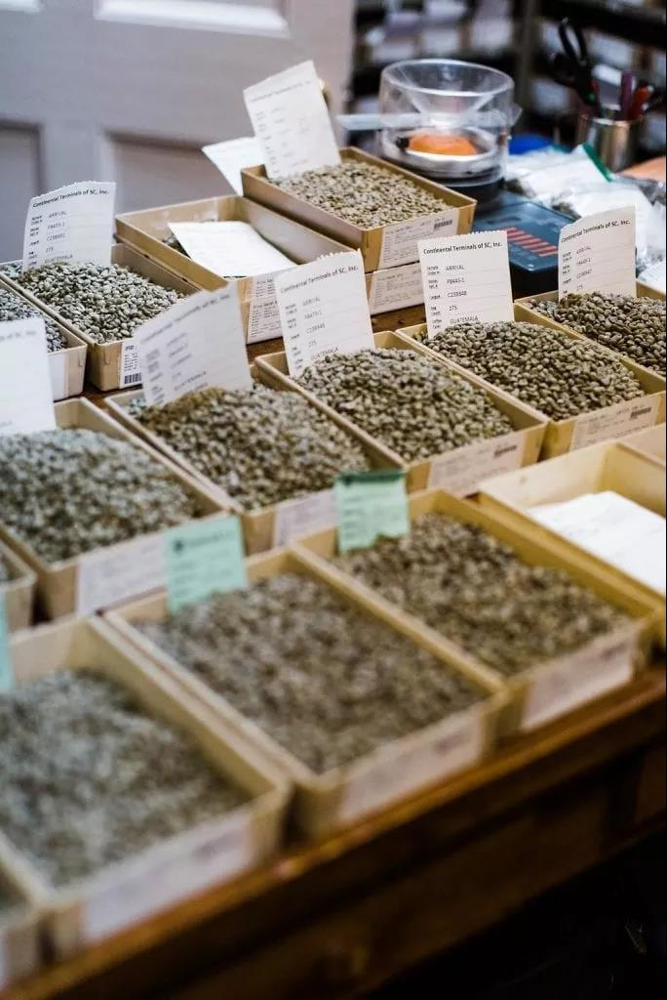
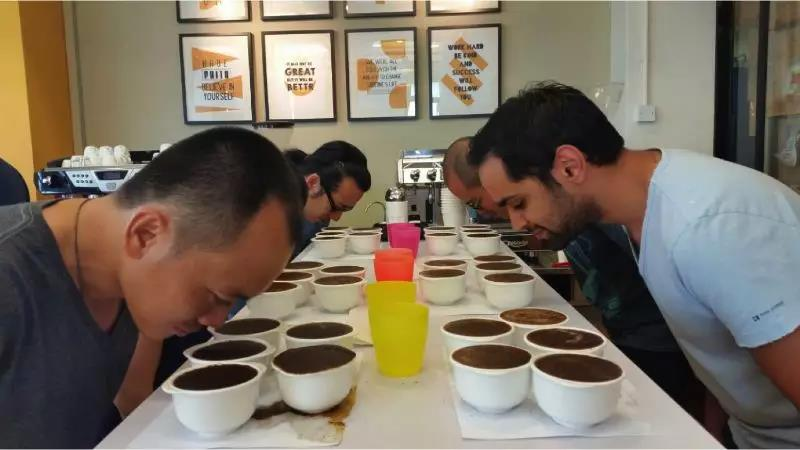

## 如何考取「咖啡质量鉴定师」Q-Grader？

杯测师必有的基本认识：
　　嗅：不同产区的咖啡香气，花香、果香、草本香，心神也跟着云游一场咖啡的世界巡礼。
　　啜：啜饮可将咖啡吸入口，以舌翼两侧来感受咖啡的酸味。

　　所谓咖啡的『杯测』、就像品选红酒一样以客观且总体性地判断咖啡的甜味及酸味、苦味、后续余韵和香气、以及质量的优劣。

　　越来越多重视生活品味的咖啡爱好者，从品味中学习鉴赏咖啡，「酸、甘、苦、咸、鲜」五味都会在舌头上的每个区间各有所司的敏感部位，使之辨别强弱，来测试咖啡质量，透过杯测才能鉴定咖啡的等级。所以咖啡质量鉴定师必须拥有咖啡的专业技术外必须学会运用「鼻腔的嗅觉」与「唇舌的味蕾」在啜吸时让空气作用于咖啡和舌头间，辅助味觉的感受找出酸甘咸鲜的最佳甜蜜点。

#全世界最贵的金舌头!#

　　面对第三次咖啡浪潮的席卷，真正喜欢咖啡并且希望传播咖啡文化的人士也愈发多了起来。高质量的咖啡也是咖啡馆未来的趋势。世界顶级咖啡企业为了杯测师的金舌头买下巨额的保险，如COSTA Café帮[杰纳罗·派利西亚](https://mp.weixin.qq.com/s/xm0PT7pMoW1F-cmU4kIWGQ)（Gennaro Pelliccia）保了1000万英镑的舌头险。平均每颗味蕾保额为1000英镑，并称：「咖啡品鉴师的味蕾非常重要，就像歌星的声带或是模特的长腿。」杯测师天天活在千香万味的幸福生活中~~您心动了吗?

那么如何成为咖啡质量鉴定师Q-Grader？

### **一、Q-Grader概念：**

　　Q-Grader为美国精品咖啡协会的合作机构CQI(国际咖啡质量鉴定学会)所认证的咖啡杯测鉴定师。Q-GRADER属于一个考试，几乎没有讲解的部分。

- 考试项目总共有22门：

  - **1项咖啡常识笔试**，就是在1小时内回答100道选择题，答对75道以上即可通过。
  - **3项味觉门坎测试**，指的是酸甜咸的味觉辨认。其中1项是找出9杯水里哪些有甜味、哪些有酸味、哪些有咸味；1项是分辨出酸甜咸各三杯里的3个浓度等级；1项是三种味道、三种等级，也就是9种溶液，互相混合，然后有8杯混合溶液，让你指出这8杯溶液里都有哪些味道、各是什么浓度等级（可能是两种味道混合、也可能是3种味道混合）。
  - **4项闻香瓶嗅觉测试**，指的就是咖啡鼻子的36味香瓶。其中这里面是按味道产生原因不同分4组的，所以分开4项单独测试。测试的方式是连连看，一边9瓶，一边6瓶，让你指出其中一组6瓶分别是另外一组9瓶里的哪一瓶。然后再写出其中指定3瓶的具体味道是什么。考试中会关灯，只开红光，还要把瓶子都包裹住，目的是不让考生通过颜色去判断。
  - **5项三角杯测**  就是5轮，每轮6组。每组3杯，其中2杯是一样的，1杯是不一样的，找出其中不一样的那一杯。每轮6组中最多可以错一组。考试中也会关灯，只开红光，不让考生通过颜色去观察咖啡粉。
  - **1项有机酸测试**，就是有8组咖啡，每组4杯，其中有2杯是加了酸的（加入的酸有柠檬酸、苹果酸、磷酸、醋酸），把这两杯找出来。然后再写出加入的酸是什么酸。
  - **1项样品烘焙辨认**，是让你通过咖啡豆和咖啡粉的颜色来判断是否符合SCAA的杯测标准对于烘焙颜色的规定。
  - **1项生豆分级测试**  是20分钟一组总共3组，来挑选生豆，把各种SCAA规定的瑕疵豆挑选出来，并说明是何种瑕疵、计算瑕疵点数、根据瑕疵来判断是精品咖啡还是非精品咖啡。
  - **1项熟豆辨认**，是根据SCAA标准，在熟豆里挑选是否有QUAKER豆，并说明是否是精品咖啡。
  - **5项咖啡杯测**，是以SCAA杯测为基准，进行5轮（分别是巴西、哥伦比亚、东非、印度尼西亚、中美洲）。每轮有6组咖啡。对每个产区的6种咖啡以SCAA杯测表为基准进行打分。考察你的打分是否与该咖啡应有的分数相匹配。

  

　　所有项目通过，即可拿到Q-GRADER认证，如果有不过的科目，只要在18个月之内通过补考也可以。

### **二、关于考试准备与考试感受**

　　① **先来说说闻香瓶**，咖啡鼻子36味，是分为四组的：**酶化反应**、**焦糖反应**、**干馏反应**以及**芳香污染**，每种9瓶。

　　练习的时候把每种9瓶找出，分别牢牢记住这9种都有什么味道，然后反复去闻去记忆，最重要的记忆帮助是，对照SCAA的咖啡风味轮，把风味轮的结构和所有分组和味道全都记住，然后背写下来，与4组闻香瓶中的味道去一一对应，比对哪些是风味轮有而咖啡鼻子没有，哪些是咖啡鼻子有而风味轮没有，这样的记忆效果非常好，算是完全弄懂了风味轮和咖啡鼻子之间的关系。不同批次的闻香瓶，甚至味道上的差别还是蛮大的，在我自己闻香瓶记忆中的味道和考试时使用的是有一些差别的。不过考试更大的目的是考察考生的短时间内的嗅觉记忆力，因此只要之前做过认真的练习，应该还是可以顺利通过的。

　　② **再来说说笔试**。笔试也是通过率比较低的一项。考题可以说是覆盖面很广，[CQI网站](https://www.coffeeinstitute.org/)上有参考的书籍以及大致的考试范围。内容包括种植、品种、产区、处理、杯测、制作、甚至是贸易等各个领域。个人建议在熟读SCAA杯测手册和生豆瑕疵手册基础上，尽量多看些各类咖啡书籍。

　　③ **生豆分级**，这一门也是通过率最低的。因为要在20分钟内挑拣出350克样品中的所有符合SCAA规定的瑕疵，并分类，然后还要把考卷填好，时间还是非常紧张的。如果不是平时经常挑拣生豆，并且学习过SCAA的分级标准，确实是有难度的。我们平时挑豆中对于有些瑕疵过于苛刻，实际上并不属于SCAA规定的瑕疵类型。而且有些瑕疵确实很难判断，需要一定的经验。建议熟读SCAA的生豆瑕疵手册，熟练掌握6种一类瑕疵，10种二类瑕疵，并牢记每一种的瑕疵点数。这样才能有足够的时间。SCAA规定精品咖啡350克样品瑕疵点数不能超过5个，其中不能有一类瑕疵。有些人误以为瑕疵点数5个指的是350克生豆中瑕疵豆不能超过5个豆。实际上每种瑕疵类型，都有对应的瑕疵点数计算规定。比如有的瑕疵5个瑕疵豆才算一个点，有的瑕疵10个瑕疵豆才算一个点。350克样品中，瑕疵豆种类分布如果非常碰巧的话，挑选出90多颗瑕疵豆，仍然有机会可以算做是精品咖啡。

　　④ **关于味觉门槛测试**。酸甜咸的溶液且浓度不同混在一起然后去分辨出都有哪些味道，还要写出级别是非常难的。按照味觉研究，全世界的人里25%是属于味觉最敏感的，50%是属于味觉普通的，25%是属于味觉不敏感的。我想这门测试主要就是要把那些味觉最不敏感的人群给剔除掉。因为这些人本身就不适合做咖啡品鉴师的工作。有幸的是，亚洲人应该算是味觉比较敏感的人群。其中亚洲的女性又是全世界所有人群里，味觉敏感度最高的。

　　⑤**三角杯测**。关于5轮的三角杯测，这个就真的跟个人的嗅觉和味觉有很大关系了。5轮考题也是一轮比一轮难。第一轮6组基本上通过闻咖啡粉的味道就可以大概确定是哪一杯，然后喝的时候再确认一下就可以了。到了最后一轮，几乎6组咖啡，没有一组通过闻干粉香就能准确判断出，甚至喝的时候风味都差不多，通过咖啡吸进口腔后，对舌头刺激的位置不同来分辨的，因为喝起来风味真的差不多很难分辨。

　　⑥**有机酸、烘焙样品辨认、熟豆辨认**基本上算是考试中比较容易的科目。大部分应该都可以通过。有机酸听着玄乎，实际上只要对酸度敏感，能分辨出哪杯里加入了酸，基本就可以通过，如果能写对到底是苹果酸、柠檬酸还是磷酸、醋酸就可以加分。烘焙样品辨认，主要是了解SCAA对于适合杯测的咖啡烘焙度的规定，对于58、63那些色谱数值了解清楚是什么意思基本就可以通过了。熟豆辨认，就是去找100克熟豆样品中是否有QUAKER豆，根据SCAA规定，100克熟豆样品中如果有1颗QUAKER就不算做是精品咖啡。对于QUAKER，是要颜色真的是明显浅很多才能算，稍微浅一点，但是也进行了焦糖化反应，就不能算QUAKER。

　　⑦**关于杯测的5门**，考试的要求也是这样，对于5轮，每轮6组咖啡，分别按照SCAA标准打分，所打分数要接近该咖啡的标准分数。而且每轮中6组咖啡的好坏趋势要正确，6组咖啡有的好有的差，精品非精品要分辨清楚。

　　每轮的考试，讲师都会先拿一支咖啡出来进行打分校正，分项去统计所有人的分数和讲师的分数。确定这杯校正咖啡的分数。在正式考试中，校正的咖啡，也会是那6组咖啡中的1组，但不会告诉考生是哪1组，看考生再次给该咖啡打分是否能够跟校正的标准能够符合。

### 【推荐阅读】：

[咖啡师要考证书吗？有没有必要上咖啡认证课程？](https://mp.weixin.qq.com/s/6Ujay2RTQuFC4OCfCvN2aA)
[如何成为一名光荣的咖啡师？当学徒还是上培训课程好？](https://mp.weixin.qq.com/s/HlDRAerrHh3P4g6MYZJXhQ)